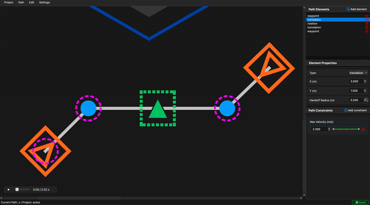

# Key Parameters

Understanding these key parameters is essential for tuning BLine paths for optimal performance.

## Handoff Radius

The **intermediate handoff radius** determines how close the robot must get to a translation target before advancing to the next one. On the canvas, this is visualized as a **magenta dashed circle** around translation elements.

<!-- GIF: Showing handoff radius circles on canvas -->


### How It Works

When the robot enters the handoff radius of the current target, the path follower advances to the next element. This creates smooth transitions between segments without requiring the robot to come to a complete stop at each point.

### Tuning Guidelines

| Radius Size | Behavior | Use Case |
|-------------|----------|----------|
| **Smaller** | Robot waits longer before switching targets | Better precision at waypoints, but can cause hesitation |
| **Larger** | Robot switches sooner | Smoother transitions at speed, but may cut corners |

!!! danger "Critical Warning"
    If the radius is too small, the robot may overshoot and miss the handoff zone entirely at high velocities—this causes erratic path behavior and is the **worst-case scenario**.

### Setting Handoff Radius

**Per-element** in the GUI sidebar, or via the `intermediate_handoff_radius_meters` field in JSON.

**Project-wide default** in **Settings → Robot Config** (GUI) or via `config.json`:

```json
{
    "default_intermediate_handoff_radius_meters": 0.3
}
```

## t_ratio (Rotation Targets)

The **t_ratio** parameter defines *where* along the path segment (0.0 to 1.0) a rotation should be achieved. This only applies to `RotationTarget` elements.

### Values

| t_ratio | Position Along Segment |
|---------|------------------------|
| `0.0` | Rotation at the **start** of the segment |
| `0.5` | Rotation at the **midpoint** |
| `1.0` | Rotation at the **end** of the segment |

### How It's Used

The path follower calculates the robot's progress along the current segment as a ratio (0.0 to 1.0). Rotation targets are processed when the robot's progress exceeds the target's t_ratio.

For **profiled rotation**, the rotation setpoint interpolates smoothly based on progress. For **non-profiled rotation**, the robot immediately adopts the target heading upon reaching the t_ratio threshold.

### GUI Interaction

In the GUI, simply drag the RotationTarget along its connecting line to adjust the t_ratio visually. The element snaps to positions along the segment.

<!-- GIF: Dragging rotation target to adjust t_ratio -->


## Profiled Rotation

The **profiled rotation** setting controls how the robot transitions to a target rotation.

### Profiled (Default: `true`)

The robot smoothly interpolates its heading based on t-ratio progression along the path:

- As the robot travels, its rotation setpoint **gradually transitions** toward the target heading
- The transition is **proportional to segment progress**
- Results in smooth, predictable rotation behavior

```json
{
    "type": "rotation",
    "rotation_radians": 1.57,
    "t_ratio": 0.5,
    "profiled_rotation": true
}
```

### Non-Profiled (`false`)

The robot immediately snaps to the target rotation when it enters the segment:

- **No interpolation** based on position
- Useful when you want an **immediate** rotation change
- Can be more aggressive but less smooth

```json
{
    "type": "rotation",
    "rotation_radians": 1.57,
    "t_ratio": 0.5,
    "profiled_rotation": false
}
```

### When to Use Each

| Mode | Best For |
|------|----------|
| **Profiled** | Most situations; smooth autonomous routines |
| **Non-Profiled** | Quick reaction rotations; when you need immediate heading change |

Toggle this setting per-element in the sidebar under "Profiled Rotation".

## End Tolerances

End tolerances determine when the path follower considers the path complete.

### End Translation Tolerance

How close (in meters) the robot must be to the **final position** to finish the path.

- **Smaller values** → More precise final positioning, but may take longer or oscillate
- **Larger values** → Faster completion, but less precise

Typical values: `0.02` to `0.1` meters

### End Rotation Tolerance

How close (in degrees) the robot must be to the **final heading** to finish the path.

- **Smaller values** → More precise final heading
- **Larger values** → Faster completion

Typical values: `1.0` to `5.0` degrees

### Setting Tolerances

**In code:**

```java
Path.PathConstraints constraints = new Path.PathConstraints()
    .setEndTranslationToleranceMeters(0.02)  // 2 cm
    .setEndRotationToleranceDeg(1.0);        // 1 degree
```

**In JSON:**

```json
{
    "constraints": {
        "end_translation_tolerance_meters": 0.05,
        "end_rotation_tolerance_deg": 2.0
    }
}
```

## Parameter Interaction

These parameters interact with each other and with velocity constraints:

```
┌─────────────────────────────────────────────────────────────┐
│                    Path Following Flow                       │
├─────────────────────────────────────────────────────────────┤
│  1. Robot approaches translation target                      │
│  2. Velocity limited by max_velocity constraint              │
│  3. When within handoff_radius → advance to next target      │
│  4. Rotation interpolated based on t_ratio (if profiled)     │
│  5. At final element, check end_tolerances                   │
│  6. Path complete when within both tolerances                │
└─────────────────────────────────────────────────────────────┘
```

!!! tip "Balancing Parameters"
    - **Higher velocity** requires **larger handoff radius** to prevent overshoot
    - **Tighter turns** benefit from **lower velocity** constraints on those segments
    - **Precision maneuvers** need **smaller tolerances** and **lower velocities**

