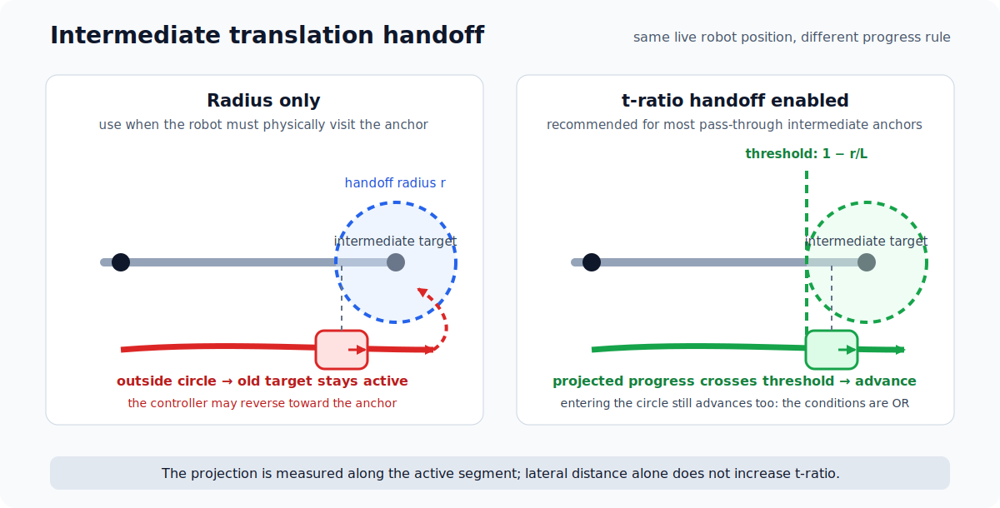

# Handoffs, t-ratio & Completion

Three progress rules determine when BLine moves between elements and when a command ends.

The key mental model is that an intermediate anchor is usually a **pass-through target**, not a stop. A handoff tells BLine when to stop steering toward that anchor and begin steering toward the next one.

## Intermediate translation handoff

For every translation anchor except the final one, the handoff radius is a circle around the target. When the live robot position enters that circle, BLine advances to the next translation target.

The resolved radius comes from:

1. the element's optional handoff radius; or
2. the project's global `default_intermediate_handoff_radius_meters`.

### Choose a radius the robot can enter

| Symptom | Likely mismatch |
| --- | --- |
| Robot cuts a corner | Radius is large relative to the intended geometry |
| Robot passes the point, reverses, and repeats | Velocity/stopping distance is too high for the radius |
| Robot pauses at every intermediate point | Radius is small, local velocity is low, or too many anchors were added |

Lower the maximum velocity into a difficult handoff before making the circle larger. A larger radius changes **where the route turns**; a lower velocity cap keeps the intended turn location while making it easier for the robot to reach.

## Recommended for pass-through anchors: t-ratio handoff

`FollowPath.Builder.withTRatioBasedTranslationHandoffs(true)` adds a second handoff condition. For a segment of length `L` and handoff radius `r`, BLine computes a projected-progress threshold of `clamp(1 − r/L, 0, 1)`. The follower may advance when either:

- the robot enters the handoff radius; **or**
- its projection onto the current segment reaches that threshold.

```java
FollowPath.Builder builder = new FollowPath.Builder(/* ... */)
    .withTRatioBasedTranslationHandoffs(true);
```

This option is **off by default** in BLine-Lib v0.9.1 and persists on the builder after you enable it. For most paths whose intermediate anchors are pass-through points, enabling it is the recommended starting behavior.

The threshold is the progress of a point one handoff radius before the target along the segment centerline:



With radius-only handoff, that offset robot continues steering back toward the circle and can reverse after passing it. With t-ratio handoff enabled, passing either test advances the target:

| Mode | Advances when | Best fit |
| --- | --- | --- |
| Radius only | Robot position enters the handoff circle | An anchor the robot must physically visit |
| T-ratio enabled | Circle entry **or** projected progress reaches the threshold | Most ordinary pass-through intermediate anchors |

Projection-based handoff can advance while the robot is laterally outside the circle. Keep radius-only behavior for the uncommon case where physically reaching that point is essential, and test t-ratio paths around narrow clearances where lateral error matters. Neither mode removes the need for achievable velocity caps and a realistic handoff radius.

!!! note "Two different uses of t-ratio"
    Translation handoff derives a threshold from segment length and handoff radius. You do not author that number. Rotation targets and events use an authored `t_ratio`, described below.

## `t_ratio` for rotation and events

`t_ratio` maps a rotation target or event trigger onto the line between surrounding translation anchors:

- `0.0` — segment start
- `0.5` — segment midpoint
- `1.0` — segment end

BLine evaluates progress from the robot's geometric projection onto that segment, not elapsed time. A sideways disturbance does not by itself fire a marker unless the projected progress passes it.

Keep hand-authored event ratios inside `[0, 1]`. Rotation ratios are clamped internally in v0.9.1; event ratios are not.

## Profiled rotation

When `profiled_rotation` is true, the target heading interpolates from the previous rotation target as segment progress advances. When false, the full target becomes active immediately.

Use profiled rotation for a gradual heading change. Use non-profiled rotation when the robot should begin driving directly toward a new angle, while still respecting the rotational velocity and acceleration constraints.

If rotation has not reached its target by the desired point:

1. check the rotational max velocity and acceleration;
2. move the target earlier;
3. lengthen the segment; or
4. use a non-profiled target when that behavior is appropriate.

## Final completion

The final translation anchor does not use an intermediate handoff. `FollowPath` finishes only when:

- no later translation target remains;
- no later rotation target remains;
- translation error is inside the path/global translation tolerance; and
- rotation error is inside the path/global rotation tolerance.

!!! warning "No final velocity tolerance in v0.9.1"
    The command can enter both tolerances while still moving. `end()` then sends zero chassis speeds. Test the endpoint at the path's real maximum speed and use a smaller local velocity cap when a gentle arrival matters.

### Tolerance tradeoff

- Tighter values increase precision but make localization noise and controller tuning more visible.
- Looser values finish sooner but may accept a pose that is not sufficient for scoring.
- An advanced minimum-velocity baseline is disabled inside the corresponding tolerance, but an overly large baseline can still carry the robot through it.

Choose the tolerance from the task requirement, then tune and constrain the approach to meet it repeatably.

## Start pose and heading

`Path.getStartPose()` uses the first translation and the first available rotation. If a path contains only translation targets, `FollowPath` uses the live starting heading as its fallback and holds that orientation.

Reset localization once at autonomous start when the path start should establish field pose. Let `FollowPath` supply the start pose after its configured flip/mirror transforms. See [First Path Tutorial](../getting-started/quick-start.md#one-time-pose-reset).

## Related logs

| Question | Key |
| --- | --- |
| How far through this segment is the robot? | `FollowPath/currentSegmentProgress` |
| Did an anchor handoff happen? | `FollowPath/translationHandoffOccurred` |
| Which elements changed? | `FollowPath/translationHandoffFromIndex`, `...ToIndex` |
| What rotation is active? | `FollowPath/targetRotationDeg` |
| Is the command inside final tolerances? | `FollowPath/finishedTranslationAtSetpoint`, `...RotationAtSetpoint` |

See [Logging & AdvantageScope](../lib/logging.md) for full semantics.
