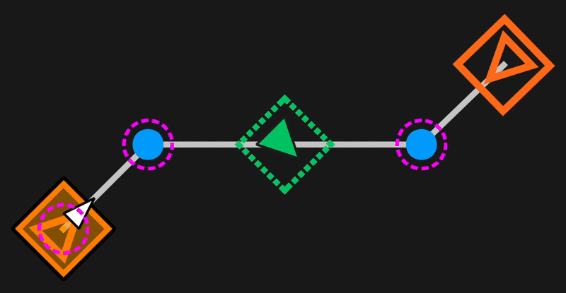

# Path Elements

A BLine `Path` is an ordered sequence of **path elements**. Understanding the four element types — and the rules they follow together — is essential for designing reliable paths, whether you build them in the GUI or in code.

## The four element types

| Element | Role | Canvas appearance |
|---------|------|-------------------|
| **Waypoint** | Position **and** holonomic rotation target | Orange rectangle with rotation handle |
| **TranslationTarget** | Position-only target (shapes the path) | Blue circle |
| **RotationTarget** | Rotation-only target interpolated along a segment | Green dashed rectangle with rotation handle |
| **EventTrigger** | Fires a registered action at a point along a segment | Yellow line marker |



**Translation elements** (Waypoints and TranslationTargets) form the backbone of the path. The robot drives through each in sequence along straight-line segments. **Rotation elements** (Waypoints and RotationTargets) define how the holonomic heading evolves. **Event triggers** fire a user-registered `Runnable` or `Command` when the robot's projection onto the path crosses a configured position along a segment.

!!! info "Path endpoints"
    The first and last elements of a path must both be a `Waypoint` or a `TranslationTarget`. A path that begins or ends with a standalone `RotationTarget` or `EventTrigger` is invalid and will be refused. A single-element path consisting of only one `Waypoint` or `TranslationTarget` is valid — this is how you do a simple drive-to-pose.

---

## Waypoints

A `Waypoint` carries both a translation target and a rotation target. Use one wherever the robot needs to **be at a location** *and* **face a particular direction** — scoring pockets, intake stations, final alignment poses.

```java
// From Translation2d + Rotation2d
new Path.Waypoint(new Translation2d(1.0, 1.0), Rotation2d.fromDegrees(0));

// From Pose2d
new Path.Waypoint(new Pose2d(1.0, 1.0, Rotation2d.fromDegrees(0)));

// With a custom handoff radius (meters)
new Path.Waypoint(new Pose2d(1.0, 1.0, Rotation2d.fromDegrees(0)), 0.3);

// Non-profiled rotation (robot snaps to heading instead of interpolating)
new Path.Waypoint(pose, /*profiledRotation=*/ false);
```

JSON form:

```json
{
    "type": "waypoint",
    "translation_target": {
        "x_meters": 1.0,
        "y_meters": 1.0,
        "intermediate_handoff_radius_meters": 0.2
    },
    "rotation_target": {
        "rotation_radians": 0.0,
        "profiled_rotation": true
    }
}
```

---

## Translation targets

A `TranslationTarget` only commands position — it shapes the path the robot takes without pinning a specific holonomic heading there.

```java
new Path.TranslationTarget(new Translation2d(2.0, 2.0));
new Path.TranslationTarget(2.0, 2.0);
new Path.TranslationTarget(2.0, 2.0, 0.3); // custom handoff radius
```

JSON form:

```json
{
    "type": "translation",
    "x_meters": 2.5,
    "y_meters": 2.0,
    "intermediate_handoff_radius_meters": 0.2
}
```

**When to reach for one:** intermediate points that only exist to curve the path around an obstacle, keep the robot on a corridor, or break a long straight into pieces where you want per-section velocity limits.

!!! tip "Prefer TranslationTargets over Waypoints for path shaping"
    Every waypoint pins rotation, which costs rotation bandwidth. If you don't actually need the robot to face a specific way at an intermediate point, use a TranslationTarget — the rotation controller is then free to smoothly transition between the waypoints that *do* matter.

---

## Rotation targets

A `RotationTarget` lives **between** two translation elements and specifies a heading the robot should reach partway along that segment. The **t_ratio** parameter (0.0–1.0) fixes where along the segment the target is evaluated.

```java
// Rotate to 90° by the midpoint of the segment
new Path.RotationTarget(Rotation2d.fromDegrees(90), 0.5);

// Snap instantly instead of interpolating
new Path.RotationTarget(Rotation2d.fromDegrees(90), 0.5, /*profiledRotation=*/ false);
```

JSON form:

```json
{
    "type": "rotation",
    "rotation_radians": 1.5708,
    "t_ratio": 0.5,
    "profiled_rotation": true
}
```

In the GUI, drag a RotationTarget along its segment to adjust its `t_ratio` visually.


### Profiled vs non-profiled rotation

Rotation targets (and the rotation embedded in a Waypoint) carry a `profiled_rotation` flag:

| Mode | Behavior |
|------|----------|
| `profiled_rotation = true` *(default)* | The rotation setpoint **interpolates** between the previous rotation target and this one, following the robot's progress along the segment. Produces smooth sweep-style turns. |
| `profiled_rotation = false` | The rotation setpoint **snaps** to this heading immediately. Use for sharp, intentional reorientations that shouldn't be spread across the segment. |

In both cases the rotation PID still enforces the configured max rotational velocity and acceleration.

---

## Event triggers

An `EventTrigger` is a zero-width element that fires a registered action when the robot's projection onto the current segment reaches the trigger's `t_ratio`. See [Event Triggers](event-triggers.md) for the full guide. Minimal example:

```java
// Register once, at robot init
FollowPath.registerEventTrigger("shoot", () -> shooter.shoot());

// Place it in a path
new Path(
    new Path.Waypoint(new Translation2d(1, 1), Rotation2d.fromDegrees(0)),
    new Path.EventTrigger(0.5, "shoot"),
    new Path.Waypoint(new Translation2d(3, 1), Rotation2d.fromDegrees(0))
);
```

JSON form:

```json
{
    "type": "event_trigger",
    "t_ratio": 0.5,
    "lib_key": "shoot"
}
```

The trigger fires once per run, based on the robot's projected position along the segment — it fires even if the robot is off the nominal path line.

---

## Building complete paths

The four element types compose freely:

```java
Path myPath = new Path(
    // Start at (1,1) facing 0°
    new Path.Waypoint(new Translation2d(1.0, 1.0), Rotation2d.fromDegrees(0)),

    // Fire the intake action halfway through the first segment
    new Path.EventTrigger(0.5, "deployIntake"),

    // Curve through (2,2)
    new Path.TranslationTarget(new Translation2d(2.0, 2.0)),

    // Spin to 90° at the midpoint of the next segment
    new Path.RotationTarget(Rotation2d.fromDegrees(90), 0.5),

    // End at (3,1) facing 180°
    new Path.Waypoint(new Translation2d(3.0, 1.0), Rotation2d.fromDegrees(180))
);
```

!!! info "Ordinals and constraints"
    Each translation element gets a **translation ordinal**; each rotation element gets a **rotation ordinal**. Waypoints increment both. These ordinals are what [ranged constraints](constraints.md#ranged-constraints) refer to when you want per-section velocity/acceleration limits.

### Single-element paths

A single `Waypoint` path is a valid, useful construct — it turns BLine into a clean drive-to-pose command:

```java
Path alignToReef = new Path(
    new Path.Waypoint(reefScoringPose)
);
pathBuilder.build(alignToReef).schedule();
```

This is often the simplest way to do teleop auto-align: build the path on button press, schedule the command, and let BLine handle acceleration limiting, rotation, and tolerances.

## Next

- [Constraints](constraints.md) — global vs path-specific vs ranged.
- [Event Triggers](event-triggers.md) — registering actions and placing triggers.
- [Key Parameters](key-parameters.md) — handoff radii, t_ratio, tolerances.
