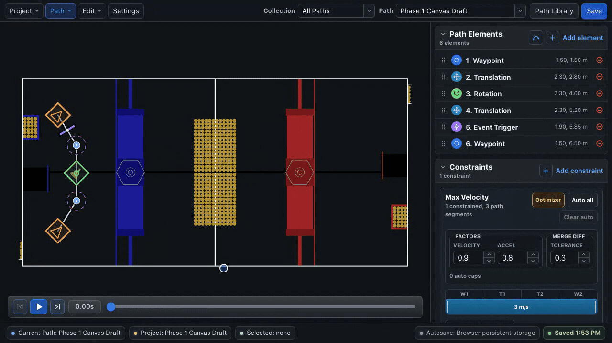
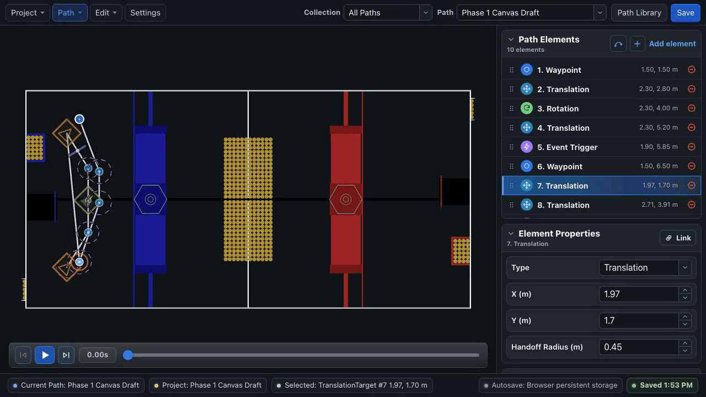

# Path Elements

A BLine path is an ordered list of translation anchors plus optional rotation targets and events between them.

## Element summary

| Element | Contains | Use it for |
| --- | --- | --- |
| **Waypoint** | Position and rotation | A point where both field position and heading matter |
| **Translation Target** | Position | Shaping the route without introducing a new heading target |
| **Rotation Target** | Rotation and `t_ratio` | Changing heading at a position along a translation segment |
| **Event Trigger** | Library key and `t_ratio` | Starting robot behavior as geometric progress passes a marker |

Waypoints and translation targets are **anchors**. Rotation targets and event triggers are **segment elements**: their `t_ratio` places them between surrounding anchors.

## Waypoint

A waypoint combines a translation target and rotation target.

```java
new Path.Waypoint(
    new Translation2d(6.2, 3.1),
    Rotation2d.fromDegrees(90)
)
```

Use a waypoint when heading has meaning at that location, especially at the start or end of a scoring move. Do not use one merely because you need the path to bend; a translation target is clearer when rotation should continue from another target.

In BLine Web, select a waypoint to edit **X**, **Y**, **Handoff Radius**, **Rotation**, and **Profiled Rotation**.

## Translation target

A translation target shapes the polyline without adding a heading target.

```java
new Path.TranslationTarget(new Translation2d(7.4, 4.0))
```

Use translation targets to:

- route around a field feature;
- approximate a curve;
- create a range boundary for local translation constraints; or
- build a one-target drive-to-position command that holds the current heading.

The optional handoff radius controls when the follower may advance to the next anchor. The final anchor is completed by tolerance rather than an intermediate handoff.

## Rotation target

A standalone rotation target changes heading along a translation segment without changing the route.

```java
new Path.RotationTarget(
    Rotation2d.fromDegrees(135),
    0.55,
    true
)
```

`t_ratio = 0` is the beginning of the segment and `t_ratio = 1` is the end. BLine Web labels this field **Rotation Pos (0-1)**.

- **Profiled rotation** interpolates from the prior rotation target as the robot progresses.
- **Non-profiled rotation** exposes the full new target when it becomes active.

!!! warning "Java and hand-authored JSON have different omission defaults"
    The common Java `RotationTarget` constructor defaults profiled rotation to `true`. If hand-authored JSON omits `profiled_rotation`, BLine-Lib v0.9.1 reads it as `false`. Write the field explicitly in JSON.

## Event trigger

An event trigger identifies a registered robot action and a geometric segment position.

```java
new Path.EventTrigger(0.65, "deployIntake")
```

The trigger fires once when the robot's projection onto the segment passes its `t_ratio`; it does not wait for the robot center to touch a screen marker.

Keep event triggers in ascending `t_ratio` order within a segment. The runtime processes them in path order and stops at the first marker not yet reached.

See [Events](event-triggers.md) for registration, command scheduling, and requirement conflicts.

## Valid ordering

Use these rules when building paths in code or JSON:

- The first and final elements should be a waypoint or translation target.
- A standalone rotation target or event trigger must belong between translation anchors.
- Keep rotation/event markers ordered by their `t_ratio` within the segment.
- Avoid consecutive anchors at exactly the same position unless a tested behavior specifically needs a degenerate segment.
- A one-element path should contain a waypoint or translation target, never only an event or rotation target.

BLine Web enforces the allowed first/last element types when adding or converting elements.

## Draw a curve

BLine Web's **Add curve** action records a field stroke, simplifies it, and inserts up to 18 translation targets. It also creates automatic max-velocity constraints for the inserted range.

{ .gif-demo data-gif-poster="/assets/images/gif-posters/draw-curve-start.png" data-gif-end="/assets/images/gif-posters/draw-curve-end.png" data-gif-duration="7580" }
{ .gif-print-poster }

The result is ordinary editable BLine geometry. Remove unnecessary targets and review the automatic caps before robot testing.

## Reuse geometry with linked elements

Collections organize paths; linked elements keep shared positions synchronized. A linked translation or waypoint can be used by multiple paths, such as a common scoring pose or route handoff.

Linked-element identities are editor metadata. BLine-Lib still receives independent path JSON files with ordinary element coordinates. See [Linked Elements](../gui/linked-elements.md).

## Example path

```java
Path pickup = new Path(
    new Path.Waypoint(
        new Translation2d(3.0, 2.0),
        Rotation2d.fromDegrees(0)
    ),
    new Path.TranslationTarget(new Translation2d(5.5, 2.8)),
    new Path.RotationTarget(Rotation2d.fromDegrees(45), 0.5, true),
    new Path.EventTrigger(0.7, "startIntake"),
    new Path.Waypoint(
        new Translation2d(7.2, 3.6),
        Rotation2d.fromDegrees(90)
    )
);
```

The route is defined by three anchors. Rotation and intake behavior happen along the second translation segment without adding corners.

## Next

- [Constraints & Ordinals](constraints.md)
- [Handoffs, t-ratio & Completion](key-parameters.md)
- [Draw & Edit Paths](../gui/canvas.md)
