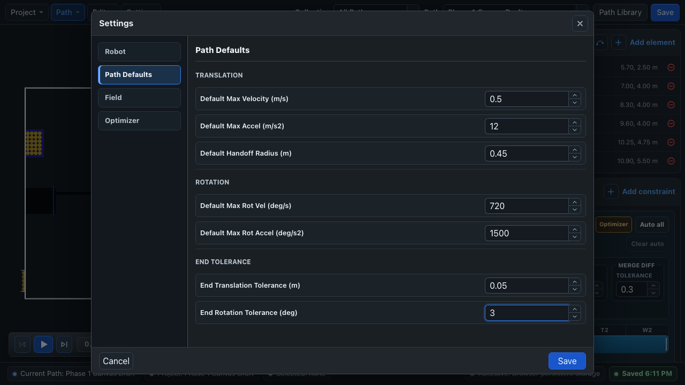
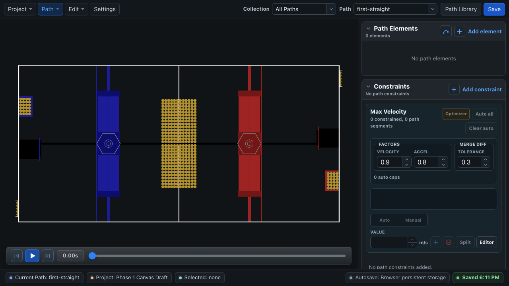
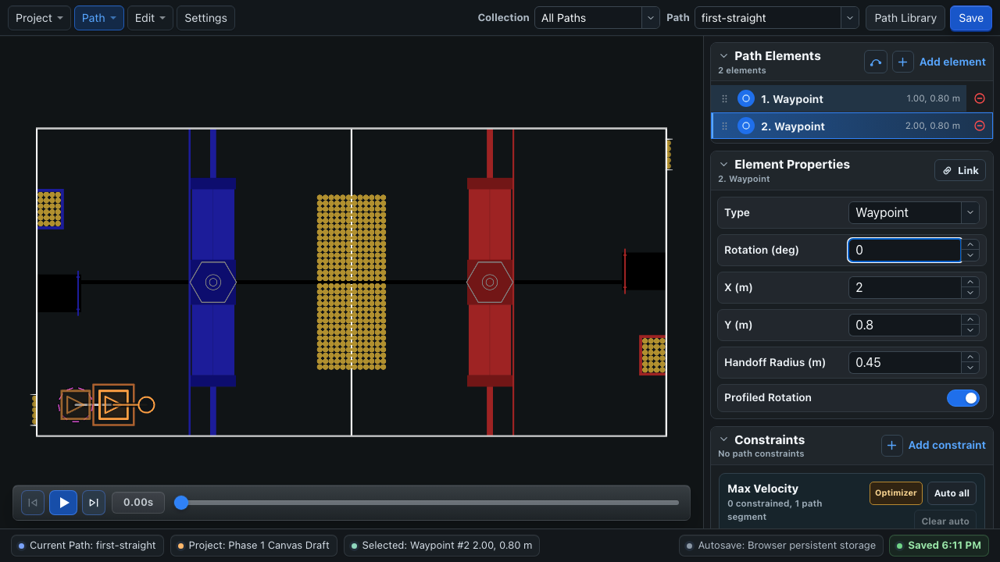
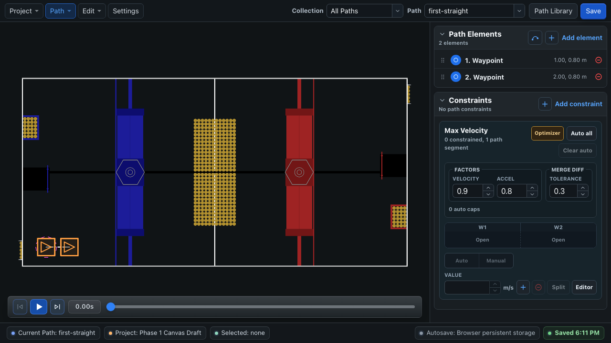
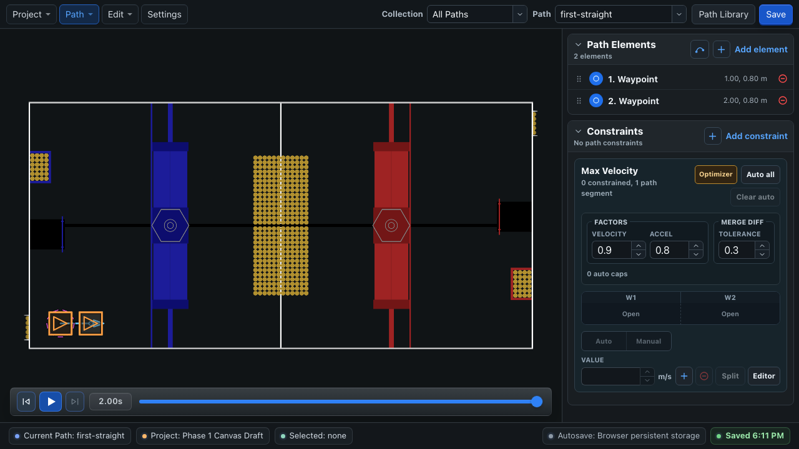

# First Path Tutorial

This tutorial creates one short path in BLine Web, exports it into a robot project, and follows it with BLine-Lib. The first run is intentionally slow. Its job is to verify the complete editor-to-robot workflow before you tune for competition speed.

!!! info "BLine Web and JSON are optional"
    This tutorial uses the editor because its field view and simulation make a first path easy to inspect. BLine-Lib can also [construct complete custom paths directly in Java](../lib/path-construction.md#construct-a-path-directly-in-java), including elements and constraints. That workflow does not require BLine Web or an exported path JSON file.

Use a **Blue alliance** Driver Station selection for this first run so the authored coordinates and physical placement match directly. Test automatic red-side transformation only after the blue-origin path works.

## What you will build

A two-waypoint path named `first-straight` on the current FRC field:

```text
start waypoint ─────────────── end waypoint
     0°                              0°
```

Expected files:

```text
src/main/deploy/autos/
├── config.json
└── paths/
    └── first-straight.json
```

The tutorial uses these starting values:

| Setting | Tutorial value | Why |
| --- | ---: | --- |
| Maximum translation velocity | `0.5 m/s` | Limits how fast the first test can move. |
| Maximum translation acceleration | `12 m/s²` | Lets the command respond promptly when the translation PID asks it to accelerate or decelerate. |
| Translation P | `2.0` | Starting gain for speed from remaining path distance. |
| Rotation P | `1.0` | Starting gain for angular speed from heading error. |
| Cross-track P | `0.2` | Starting gain for lateral correction toward the segment. |

These are **tutorial values**, not a universal tune. A new BLine Web project currently starts at `4.5 m/s` maximum translation velocity and `12 m/s²` maximum translation acceleration. For this first path, lower the velocity and leave the acceleration at its product default.

!!! info "Why low velocity and high acceleration are not contradictory"
    Maximum velocity limits the robot's speed. Maximum acceleration limits how quickly BLine's final velocity command may change, including when the PID asks the robot to slow near the endpoint. A low acceleration ceiling can delay that correction and change how the endpoint behaves. Use `0.5 m/s` to make this first run slow without unnecessarily restricting the controller's response.

## 1. Create a project

Open [BLine Web](https://bline-web.pages.dev/).

- **Browser:** choose **Project → Workspace → New Project**.
- **Desktop:** choose **Project → Folder → Create Project Folder…**, then select the robot repository or `src/main/deploy/autos`.

Open **Settings**:

1. Under **Field**, confirm the latest FRC field is selected. For the current docs, that is **REBUILT 2026**.
2. Under **Robot**, enter the bumper-to-bumper length and width.
3. Under **Path Defaults → Translation**, set **Default Max Velocity (m/s)** to `0.5`.
4. Leave **Default Max Accel (m/s2)** at `12`.
5. For this first test, use an end translation tolerance around `0.05 m` and an end rotation tolerance around `3°`.
6. Save the settings.



## 2. Create the path

Choose **Path → Manage Paths → Create New Path**, name it `first-straight`, and create it outside a collection for now.

Add two **Waypoint** elements from the **Path Elements** panel:

| Element | X | Y | Rotation |
| --- | ---: | ---: | ---: |
| Start | `1.0 m` | `0.8 m` | `0°` |
| End | `2.0 m` | `0.8 m` | `0°` |

You can type the values in **Element Properties** or drag the waypoint on the field.

{ .gif-demo data-gif-source="/assets/gifs/web/first-path-setup.gif" data-gif-poster="/assets/images/gif-posters/first-path-setup-start.png" data-gif-end="/assets/images/gif-posters/first-path-setup-end.png" data-gif-duration="8250" }
{ .gif-print-poster }

This short lower blue-side corridor stays before the first large blue field structure on the bundled 2026 REBUILT field for an ordinary bumper footprint. Still confirm the route against your configured dimensions and the official field setup.

!!! info "Why both elements are waypoints"
    A waypoint contains translation and rotation. The first one gives the path an unambiguous start pose; the final one gives the follower a final heading to satisfy before finishing.

## 3. Preview the structure

Press **Play** in the transport controls beneath the field. Confirm that:

- the footprint starts at the first waypoint;
- it travels along the line to the second waypoint;
- the heading stays at `0°`; and
- the simulation reaches the end without reversing.

{ .gif-demo data-gif-source="/assets/gifs/web/first-path-simulation.gif" data-gif-poster="/assets/images/gif-posters/first-path-simulation-start.png" data-gif-end="/assets/images/gif-posters/first-path-simulation-end.png" data-gif-duration="5000" }
{ .gif-print-poster }

The editor preview is idealized kinematics, not drivetrain physics. It can catch element ordering and constraint mistakes, but it cannot validate wheel slip, controller gains, voltage limits, or localization. See [Simulation](../gui/simulation.md).

## 4. Save and export

Wait for the lower-right status to show **Saved**.

=== "Browser"

    Choose **Project → Import / Export → Export Autos Folder…**. Extract the downloaded archive and copy its `autos` tree into `src/main/deploy/`.

=== "Desktop"

    If the project is already open from the robot repository or `autos` folder, saving writes the runtime files there directly.

Confirm that `config.json` and `paths/first-straight.json` exist in the robot project before deploying.

## 5. Wire the drivetrain

Create one reusable builder, usually in `RobotContainer`. The speed supplier and consumer must both use the **robot-relative** frame.

```java
import edu.wpi.first.math.controller.PIDController;
import frc.robot.lib.BLine.FollowPath;

FollowPath.Builder pathBuilder = new FollowPath.Builder(
    driveSubsystem,
    driveSubsystem::getPose,
    driveSubsystem::getRobotRelativeSpeeds,
    driveSubsystem::driveRobotRelative,
    new PIDController(2.0, 0.0, 0.0),
    new PIDController(1.0, 0.0, 0.0),
    new PIDController(0.2, 0.0, 0.0)
).withDefaultShouldFlip()
 .withTRatioBasedTranslationHandoffs(true);
```

The controller order is translation, rotation, then cross-track. These gains are a practical first-run baseline; they are not a substitute for the tuning procedure on the next page. T-ratio handoffs do not change this two-anchor path, but enabling them now gives future intermediate pass-through anchors the recommended progress-based handoff behavior.

!!! warning "Do not pass field-relative speeds"
    BLine converts its field-relative command into robot-relative `ChassisSpeeds` before calling the consumer. Driver-perspective or alliance-dependent joystick transforms also belong outside this consumer.

## 6. Load the path and reset once { #one-time-pose-reset }

Fixed paths can be loaded when `RobotContainer` is created:

```java
import edu.wpi.first.wpilibj2.command.Command;
import frc.robot.lib.BLine.Path;

Path firstStraight = new Path("first-straight");

Command firstAuto = pathBuilder
    .withPoseReset(driveSubsystem::resetPose)
    .build(firstStraight);

// Builder options persist. Clear this before building any later path command.
pathBuilder.withPoseReset(ignored -> {});
```

`FollowPath` applies the selected alliance flip and mirror to its private path copy, then passes that **transformed** start pose to the reset consumer. Reset once at the beginning of the autonomous routine, not before every path in a multi-path sequence.

!!! warning "`withPoseReset(...)` is a persistent builder option"
    Every command built while this option is set captures the reset consumer. Clear it immediately after building the first command or later paths can teleport odometry to their own starts. Do not replace this with `resetPose(firstStraight.getStartPose())` when automatic flip/mirror is enabled; that untransformed pose is on the authored side of the field.

Return `firstAuto` from the robot's autonomous selection code.

## 7. Pre-orient a swerve drivetrain

For this first path, point all swerve modules along the first direction of travel before enabling. Otherwise the robot spends the beginning of the path steering its modules and may make a small unwanted movement before it can drive forward. Pre-orientation is useful for most paths and becomes especially important as the start gets more aggressive, although a gentle, tested path may not need a separate orientation step.

BLine can calculate the initial direction for the loaded path:

```java
var initialModuleDirection = firstStraight.getInitialModuleDirection();
```

Feed that direction into your drivetrain's own module-orientation command before the path begins, or align the modules manually during robot setup. The exact command is drivetrain-specific. For this Blue-alliance tutorial path, the modules should point straight along the positive field X direction.

## 8. Run safely

1. Select **Blue alliance** and put the robot at the authored start pose.
2. Confirm the robot's reported pose matches its physical position and heading.
3. Confirm the swerve modules are pre-oriented.
4. Clear the test area and announce before enabling.
5. Run once at `0.5 m/s` maximum velocity.
6. Disable immediately if the robot moves in an unexpected direction.

## Expected result

The robot should move slowly along the straight line, decelerate near the endpoint, enter both tolerances, and receive zero chassis speeds when the command ends.

If it does not:

| Symptom | Check first |
| --- | --- |
| Drives in the wrong direction | Robot-relative speed frame and joystick/alliance transforms |
| Jumps to an unexpected pose | Pose reset and field coordinate origin |
| Turns when it should stay at `0°` | Gyro sign, robot heading, and rotation controller order |
| Stops short or repeatedly crosses the endpoint | Translation gain, tolerance, measured pose, and the final velocity command |
| Never finishes | `remainingPathDistanceMeters`, `rotationErrorDeg`, and final tolerances |
| Editor preview works but robot does not | Localization, module control, and real drivetrain response |

Continue with [Tune Your Robot](tuning.md) before building a competition path.

## Optional: publish a dashboard preview

The first path is simple enough to test without publishing it to a dashboard. After the robot follows it successfully, you can use WPILib `Field2d` to inspect loaded paths in Elastic or Glass:

```java
BLineField.drawPath(field, "FirstStraight", firstStraight);
```

The object appears as `FirstStraightTrajectory` in a Field2d-compatible dashboard. This is a useful visualization and debugging tool, but it is not required for following the path. See [Optional Field2d Visualization](../lib/field-visualization.md) for setup, Elastic examples, and transformed-path considerations.
