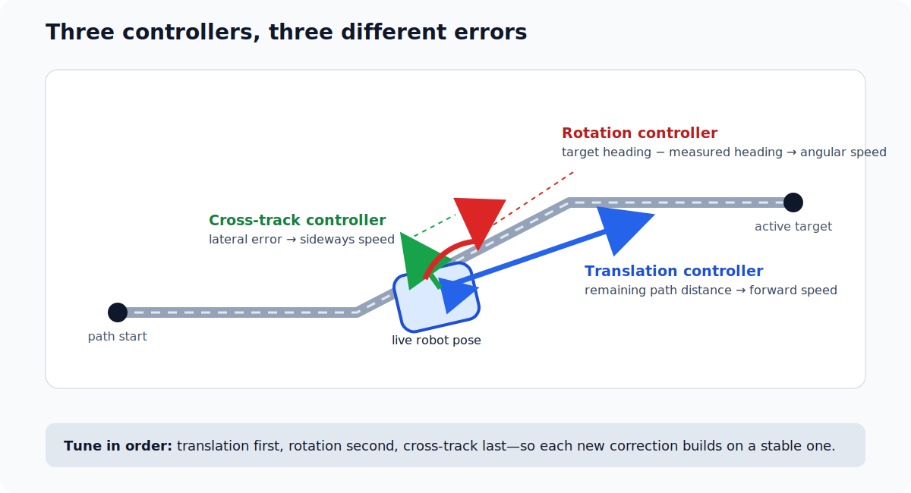
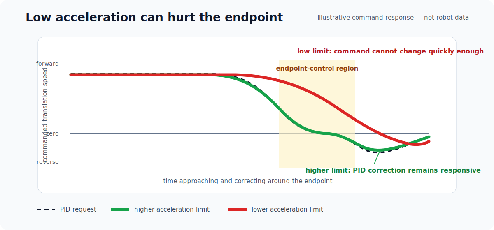
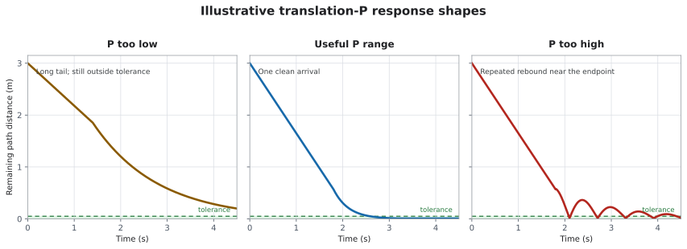
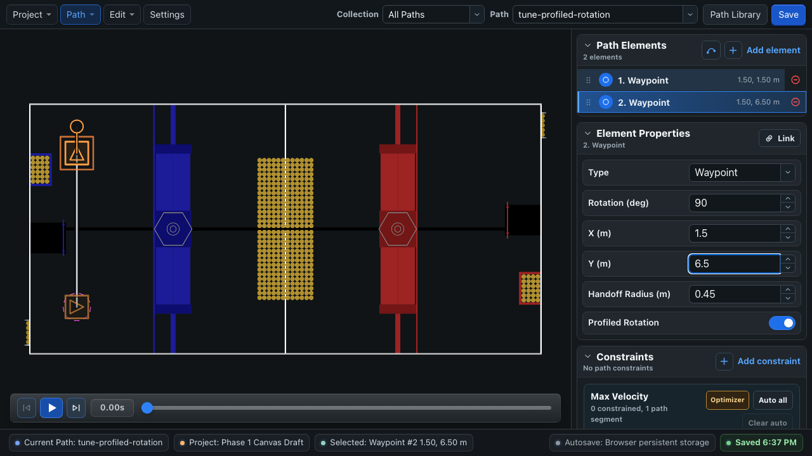
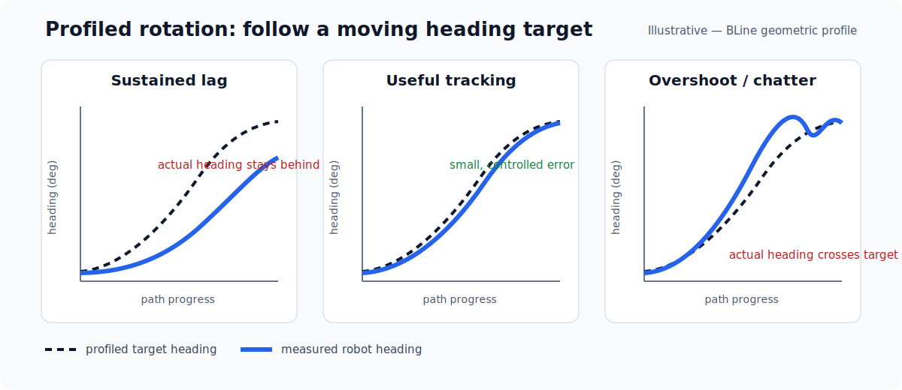
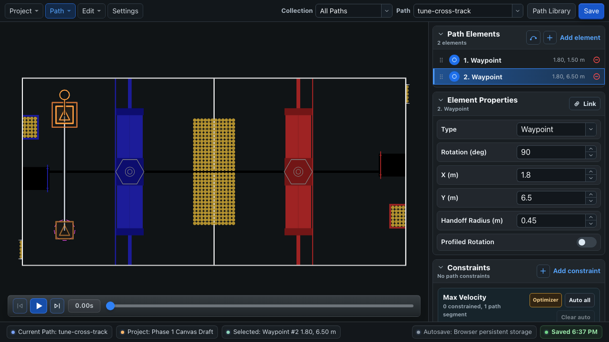
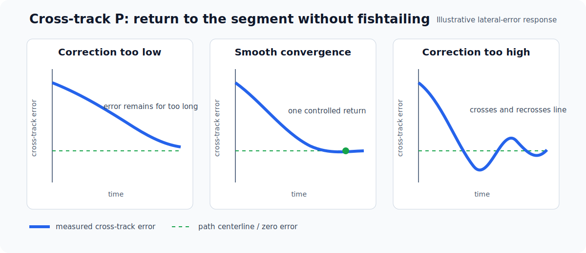

# Tune Your Robot

BLine uses three independent WPILib PID controllers to produce one chassis-speed request. Learn what each controller owns before changing any gains, then tune translation, rotation, and cross-track correction one at a time.

## PID in one minute

A PID controller compares a **measurement** with a **setpoint** and turns their difference into an output. In BLine, that output is a requested speed:

- **P** responds to the current error. More error produces more output.
- **I** responds to error accumulated over time.
- **D** responds to how quickly the error changes.

Start with P only. Add D only when a repeatable plot shows that damping is needed, and treat I cautiously—especially for cross-track control, whose integral state can persist between path commands in BLine-Lib v0.9.1. If PID is new to you, read WPILib's [Introduction to PID](https://docs.wpilib.org/en/stable/docs/software/advanced-controls/introduction/introduction-to-pid.html) and [`PIDController` documentation](https://docs.wpilib.org/en/stable/docs/software/advanced-controls/controllers/pidcontroller.html) before enabling a tuning path.

## Meet BLine's three controllers

Imagine the robot beside a straight segment while also facing the wrong direction:

| Controller | Error it sees | Output it creates | What changing P looks like |
| --- | --- | --- | --- |
| **Translation** | Remaining distance through the path | Speed toward the current translation target | Higher P keeps the request at the max-velocity ceiling closer to the endpoint. |
| **Rotation** | Difference between measured heading and active target heading | Angular speed | Higher P turns harder for the same heading error. |
| **Cross-track (CTE)** | Signed perpendicular distance from the active segment | Sideways correction toward the segment | Higher P returns to the line more aggressively. |

The translation vector points toward the current translation target. BLine adds the perpendicular cross-track correction, calculates rotation independently, and then applies active velocity and acceleration constraints to the combined request. This is why the same PID gains can behave differently when the motion constraints change.



The first-path values are useful starting points:

```java
new PIDController(2.0, 0.0, 0.0), // translation
new PIDController(1.0, 0.0, 0.0), // rotation
new PIDController(0.2, 0.0, 0.0)  // cross-track
```

They still need to be tested and tuned on your robot.

## Tune at the intended motion envelope

After the slow [first-path test](quick-start.md) proves that coordinates, frames, and stopping behavior are correct, tune with the velocity and acceleration you intend to use for ordinary competition paths. Ideally, begin with the maximum velocity and acceleration your drivetrain has already handled well during teleop testing. If the team does not have a proven operating envelope yet, a practical starting point for a capable FRC swerve is approximately:

| Constraint | Example starting value |
| --- | ---: |
| Maximum translation velocity | `4.5 m/s` |
| Maximum translation acceleration | `12 m/s²` |

These numbers are a starting point, not a target every team should force. Prefer the envelope that already produced stable, repeatable module response and traction in teleop; it is better evidence than a generic recommendation. Teams using odometry alone may choose lower velocity and acceleration to limit slip, then add faster, turn-heavy, and multi-segment tests incrementally. Tune and validate at that chosen operating envelope rather than transferring gains from different constraints. Vision-corrected localization is strongly recommended for long or movement-heavy routines, but it does not replace drivetrain characterization.

!!! warning "Do not tune fast in an undersized test area"
    The translation test needs enough clear distance to reach the velocity ceiling and return to the endpoint-control region. If your space cannot support that safely, use a larger controlled area or tune to the lower motion envelope you will actually deploy.

### Why lowering acceleration later changes the tune

BLine calculates the translation and cross-track requests first, then the chassis rate limiter limits how quickly the final command may change. The maximum acceleration therefore governs both speeding up and slowing down.

A much lower acceleration constraint can make the commanded velocity lag behind the PID request, carry speed farther into the endpoint, and make a good P gain appear too weak or too aggressive. Do not tune at `12 m/s²` and assume the same response after reducing the production path to `2 m/s²`. Prefer tuning and validating at the intended constraints. If a path needs a lower acceleration for traction or mechanism stability, re-test its endpoint behavior and retune if necessary.



## Before changing gains

Confirm that:

- the pose moves the correct distance and direction when the robot is pushed by hand;
- gyro heading follows the WPILib coordinate convention;
- the speed supplier and consumer are robot-relative;
- individual swerve-module velocity and steering control are stable;
- the test path uses the intended maximum velocity and acceleration;
- minimum-velocity constraints are disabled;
- the swerve modules are pre-oriented before each run; and
- the test area is clear and controlled.

A controller cannot compensate for an incorrect wheel radius, gear ratio, coordinate frame, or noisy pose estimate.

Record the PID values and any working configuration on scrap paper or in a small document while tuning so you can return to a known-good setup.

## Wire the evidence

Connect the `FollowPath` logging consumers before testing. The setup is in [Logging & AdvantageScope](../lib/logging.md).

For each run, compare the controller's **error**, its **raw request**, the **constrained output**, and the robot's **measured response** on the same time axis. BLine does not publish measured chassis velocity; log that from your drivetrain.

Use the same start pose, path, payload, and graph axes for repeated runs. A different battery state or carpet surface can also change the result.

## 1. Tune translation

### Build the test path

Use a straight path about `5 m` long in a clear test lane:

```text
start waypoint, 0° ───────────────────── final waypoint, 0°
```

- Use no intermediate translation targets.
- Keep start and end headings equal.
- Set rotation P and CTE P to zero for this pass.
- Set translation I and D to zero.
- Use the maximum velocity and acceleration that already worked well during teleop drivetrain testing. If those values are not known yet, begin around `4.5 m/s` and `12 m/s²` as a starting point.
- Pre-orient the modules along the segment before enabling.


The path must be long enough for the raw translation PID request to reach the velocity ceiling. With translation P at `2.0`, the unclamped request reaches `4.5 m/s` while about `2.25 m` of path remains.

### Plot the useful signals

| Signal | What it tells you |
| --- | --- |
| `FollowPath/remainingPathDistanceMeters` | Translation error through the remaining polyline. |
| `FollowPath/rawTranslationControllerOutput` | Translation PID request before the maximum-velocity clamp. |
| `FollowPath/clampedTranslationControllerOutput` | Request after the active maximum velocity. |
| `FollowPath/translationControllerOutput` | Translation request before CTE is added and chassis rate limiting is applied. |
| `FollowPath/maxTranslationVelocityMetersPerSec` | Active velocity ceiling. |
| Your commanded and measured translation speed | Whether the rate-limited request changes as expected and whether the chassis follows it. |
| `FollowPath/finishedTranslationAtSetpoint` | Whether translation is inside the configured end tolerance. |

### Change P deliberately

1. Begin around translation `P = 2.0`.
2. Run the same path and inspect the plots.
3. If the robot leaves the velocity ceiling too early and crawls toward the endpoint, increase P in small steps.
4. If it repeatedly crosses the endpoint or reverses sharply, reduce P and verify pose noise, acceleration limiting, and tolerance.
5. Add a small D only if the measured response consistently needs damping after those checks.
6. Repeat from more than one starting distance at the intended velocity and acceleration.

### The key translation-tuning picture

With P-only translation control, the raw speed request is proportional to remaining path distance. The maximum-velocity constraint clips that request while the robot is far from the end. The point where the raw request falls below the clip is where P begins to directly shape the approach.

For example, at `P = 2.0` and a `4.5 m/s` maximum, the raw request leaves the velocity ceiling at about `4.5 ÷ 2.0 = 2.25 m` remaining. Raising P moves that transition closer to the endpoint; lowering P moves it farther away. The graph below is the core mental model for translation tuning—not merely a generic overshoot chart.



*Illustrative response shapes, not measured robot data. Your plots should use identical axes and test conditions.*

### Read the plots together

| Plot pattern | Likely interpretation | Next move |
| --- | --- | --- |
| Raw request drops below the velocity ceiling early; remaining distance has a long tail | P is too low, or the drivetrain does not follow low-speed requests | Increase P gradually and compare measured velocity with the command. |
| Request stays at the ceiling, leaves it smoothly, and remaining distance reaches tolerance once | Translation is in a useful range | Repeat from different distances and verify the final velocity is safe. |
| Remaining distance enters and leaves the tolerance repeatedly while the command vector reverses toward the target | P may be too high, acceleration limiting may be delaying deceleration, or pose is noisy | Reduce P, inspect commanded versus measured velocity, and verify the pose. |
| Raw request falls but final velocity changes much later | The acceleration constraint or drivetrain response is dominating the PID | Test at the intended acceleration; verify module velocity response before changing P. |

The translation PID matters most near the endpoint. Far from the end, its raw output commonly exceeds the maximum-velocity constraint and is intentionally clamped.

!!! warning "Completion does not check final velocity"
    BLine-Lib v0.9.1 finishes when the final translation and rotation targets are inside tolerance. It does not also require near-zero measured velocity. Entering a loose tolerance at high speed can finish the command and immediately request zero. Validate the endpoint at the full intended motion envelope.

## 2. Tune rotation

Restore the chosen translation gain, keep CTE at zero, and use two versions of the same straight `4–5 m` test path. Start at `0°` and end at a clearly visible heading such as `90°`.

### Immediate target test

Use a non-profiled end rotation target. When that rotation target becomes active, its heading becomes the setpoint immediately. This test exposes the rotation controller's response to a step in target heading.

Look for:

- **P too low:** measured heading remains far behind a fixed target;
- **useful P:** heading approaches the target quickly and settles once; and
- **P too high:** heading overshoots, reverses, or chatters around the target.

### Profiled rotation test

Repeat with the end target's **Profiled Rotation** option enabled. In BLine, `profiled_rotation` means the target heading is interpolated along the shortest angular path according to the robot's **geometric progress between rotation targets**. It is not a WPILib `ProfiledPIDController`, and it does not create a time-based trapezoidal heading profile. BLine-Lib still uses the ordinary `PIDController` you supplied to `FollowPath.Builder`.





Plot:

- `FollowPath/targetRotationDeg`;
- your drivetrain's measured heading;
- `FollowPath/rotationErrorDeg`;
- `FollowPath/rotationPidOutputRadPerSec`;
- `FollowPath/outputOmegaRadPerSec`; and
- `FollowPath/finishedRotationAtSetpoint`.

For a profiled target, `targetRotationDeg` is the current interpolated setpoint. `rotationErrorDeg` is the error to the full active rotation target, so calculate measured-heading error against `targetRotationDeg` when evaluating how closely the robot follows the interpolation.

Interpret the target and measurement together:

| Plot pattern | Likely interpretation | Next move |
| --- | --- | --- |
| Measured heading trails both an immediate and profiled target by a similar amount | Rotation P may be too low, or the drivetrain cannot produce the requested omega | Increase P gradually and compare requested with measured angular speed. |
| PID request rises but `outputOmegaRadPerSec` changes slowly | Rotational acceleration is limiting the response | Validate the rotational constraints before changing P. |
| Profiled target itself reaches the final heading too late | The rotation target is placed too late or the translation segment is too short | Move the target earlier or provide more path distance. |
| Measured heading repeatedly crosses the target | P may be too high, the gyro may be noisy, or rotational velocity is excessive | Reduce P and inspect the heading signal and constraints. |

Test continuous-input wraparound near `-180°` and `180°` after the basic `90°` test works. More P cannot create distance or angular acceleration that the path does not provide.

## 3. Tune cross-track correction

Restore the chosen translation and rotation gains. Author one long straight segment, then begin the robot about `0.25 m` to one side of that line while keeping its heading parallel to the segment:

```text
authored segment  ─────────────────────────────────────
robot start            ↑ about 0.25 m lateral offset
```

For this controlled test, do not reset the pose onto the authored start point. The pose supplier must report the robot's real offset or the controller will have no cross-track error to correct.



Plot:

- `FollowPath/crossTrackError`;
- `FollowPath/crossTrackControllerOutput`;
- `FollowPath/pathTranslations`;
- `FollowPath/robotTranslations`; and
- commanded and measured field-relative translation velocity if your drivetrain logs it.

Begin around CTE `P = 0.2` and adjust in small steps:

| Plot or field behavior | Likely interpretation | Next move |
| --- | --- | --- |
| Cross-track error remains large for most of the segment | CTE P is too low, or localization is drifting | Increase P gradually and verify the pose against the field. |
| Error returns smoothly toward zero without crossing repeatedly | CTE is in a useful range | Repeat from both sides of the segment. |
| Robot snakes across the segment or loses forward speed | CTE P is too high and the lateral vector is fighting translation | Reduce P and verify measured module response. |



Use P-only CTE as the starting point. In BLine-Lib v0.9.1 the cross-track controller is not reset at every command initialization, so integral state can persist across commands.

!!! note "Orbiting an intermediate target is usually not a CTE problem"
    If the robot overshoots an intermediate element, reverses, and repeats, inspect its handoff behavior and incoming maximum velocity first. Cross-track control corrects lateral distance from the active segment; it should not compensate for an intermediate handoff the robot cannot enter.

## Shape paths after the controllers are stable

Controller gains should work across normal paths. Path-specific motion should be shaped primarily with **maximum translation velocity**:

1. Set the global maximum to the robot's tested capability.
2. Draw the path geometry.
3. Use BLine Web's optimizer to generate an initial set of maximum-velocity ranges.
4. Review those ranges around corners, scoring approaches, and mechanism-sensitive areas.
5. Simulate, test, and refine the local velocity limits.
6. Use maximum-acceleration ranges where traction or mechanism stability requires them, then revalidate the endpoint response.

Maximum velocity is a central path-authoring control: it determines how aggressively the robot approaches each part of the geometry. The optimizer provides a useful first pass, not a guarantee of real robot dynamics. See [Constraints & Optimizer](../gui/sidebar.md).

### Minimum velocity is advanced

Leave `min_velocity_meters_per_sec` and `min_velocity_deg_per_sec` at zero for ordinary paths and for initial tuning.

Minimum velocity forces a floor on controller-output magnitude while the corresponding error remains outside tolerance. Advanced uses include deliberately reaching the completion tolerance with a nonzero request for specialized chaining behavior and reshaping the controller's endpoint domain for an edge case. `FollowPath.end(...)` still commands zero when a path command finishes, so a minimum velocity does not by itself create seamless path-to-path chaining. A poorly chosen minimum can cause overshoot, reversal, or chatter, so it should not be presented as a routine drivetrain setting.

If a minimum exceeds the resolved maximum, BLine warns, falls back to the global maximum, and disables that minimum.

## Ready-for-path-work checklist

- Translation reaches the velocity ceiling and settles without repeated rebound.
- Commanded and measured speed agree well enough at the intended velocity and acceleration.
- Rotation follows immediate and profiled targets without sustained lag or repeated overshoot.
- CTE removes a lateral offset from either side without snaking.
- The command finishes consistently at the intended tolerance and with a safe final velocity.
- Pre-match module orientation is part of the autonomous setup.
- Blue and red alliance transforms have both been tested.
- Odometry-only routines have been expanded incrementally; complex routines use the best localization available.

Next, learn how to [shape motion with constraints](../concepts/constraints.md) and apply the [practical path recipes](../usage-tips.md).
