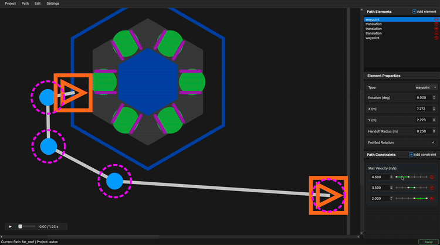

# Canvas

The canvas is the main visual workspace where you design your paths. It displays the FRC field with your path overlaid, allowing direct manipulation of path elements.

## Navigation

### Zooming

Use the **scroll wheel** to zoom in and out of the canvas.

<!-- GIF: Zooming in and out on the canvas -->

### Panning

**Click and drag on empty space** (not on an element) to pan the view around the field.

<!-- GIF: Panning the canvas view -->

## Selecting Elements

Click on any element to select it. The selected element will be highlighted, and its properties will appear in the sidebar.

## Moving Elements

**Drag translation elements** (Waypoints and TranslationTargets) to reposition them on the field.

<!-- GIF: Dragging a waypoint to a new position -->

!!! tip
    The element's coordinates update in real-time in the sidebar as you drag.

## Adjusting Rotation

Waypoints and RotationTargets have **rotation handles**—small circles extending from the element that indicate the rotation direction.

**Drag the rotation handle** to adjust the element's rotation.

<!-- GIF: Dragging rotation handle to change rotation -->

## Moving Rotation Targets

RotationTargets exist along the path segment between two anchor points. **Drag a RotationTarget along its connecting line** to adjust its t_ratio (position along the segment).

<!-- GIF: Dragging rotation target along segment -->

## Deleting Elements

Select an element and press **Delete** or **Backspace** to remove it from the path.

Alternatively, use the ✕ button in the sidebar's element list.

## Element Visualization

### Color Coding

| Element | Appearance |
|---------|------------|
| **Waypoint** | Orange rectangle with rotation handle line |
| **TranslationTarget** | Blue circle |
| **RotationTarget** | Green dashed rectangle with rotation handle line |

### Path Lines

Lines connect translation elements (Waypoints and TranslationTargets) showing the path the robot will follow. RotationTargets appear as markers along these lines.

### Handoff Radius

Each translation element displays a **magenta dashed circle** representing its handoff radius. The robot advances to the next target when it enters this circle.

<!-- GIF: Showing handoff radius visualization -->

## Constraint Visualization

When you click on a ranged constraint's slider in the sidebar, a **green overlay** highlights the affected path segments on the canvas. This helps you visualize exactly which parts of the path the constraint applies to.

<!-- GIF: Constraint overlay when clicking slider -->

## Simulation View

During simulation playback, the canvas shows:

- **Robot position** moving along the path
- **Orange trail** showing the simulated trajectory
- **Current rotation** indicated by the robot icon orientation

See [Simulation](simulation.md) for more details on the simulation features.

## Keyboard Shortcuts

| Shortcut | Action |
|----------|--------|
| `Delete` / `Backspace` | Delete selected element |
| `Space` | Play/pause simulation |
| `Ctrl+Z` / `Cmd+Z` | Undo |
| `Ctrl+Y` / `Cmd+Shift+Z` | Redo |
| `Ctrl+S` / `Cmd+S` | Save |

