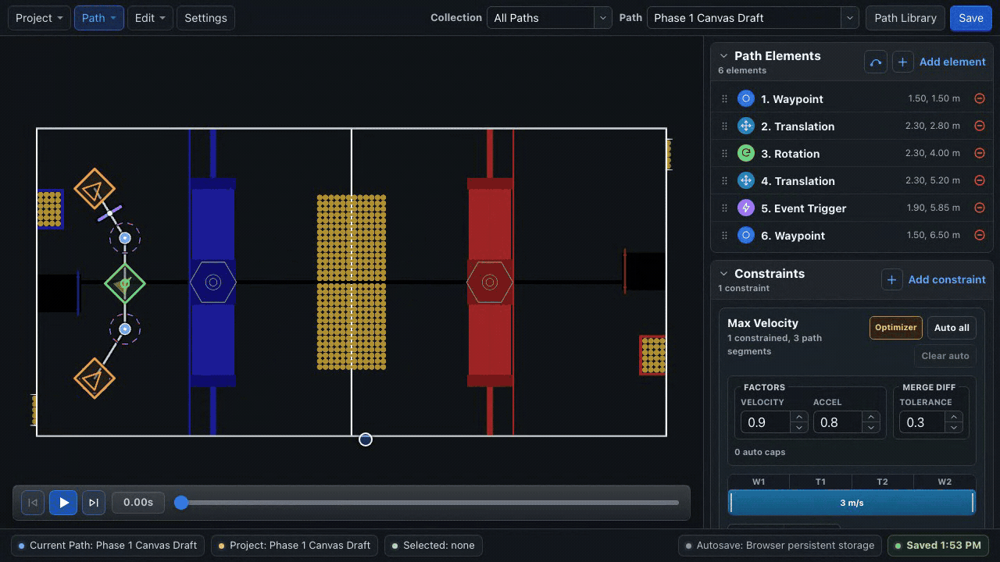

# Draw & Edit Paths

Start with a small number of anchors, then add detail only when the path needs it. Every extra element creates another geometric or behavioral decision to test.

## Add elements

The **Path Elements** header provides two authoring actions:

- **Add element** inserts a waypoint, translation target, rotation target, or event trigger after the current selection.
- **Add curve** records a stroke on the field and converts it into simplified translation targets.

If nothing is selected, new elements are appended. The first and last elements are restricted to waypoint or translation types so the path begins and ends with a valid position.

## Select and edit

Click an element on the canvas or in the list. The **Element Properties** section then exposes the fields relevant to its type:

| Element | Current editor fields |
| --- | --- |
| Waypoint | X, Y, Handoff Radius, Rotation, Profiled Rotation, linked-element controls |
| Translation | X, Y, Handoff Radius, linked-element controls |
| Rotation | Rotation, Profiled Rotation, Rotation Pos (0-1) |
| Event Trigger | Event Pos (0-1), Lib Key |

Typing a coordinate is best for a known scoring pose. Dragging is best for quick geometry iteration. Use both: drag for the shape, then enter the exact final value.

## Canvas interactions

| Interaction | Result |
| --- | --- |
| Mouse wheel/trackpad scroll | Zoom around the pointer |
| Drag empty field space | Pan |
| Click an element | Select it and reveal properties |
| Drag an anchor | Change its X/Y position |
| Drag a selected rotation handle | Change heading |
| Click empty canvas | Clear selection |
| Right-click empty field or an anchor | Open linked-element actions |

Locked linked elements cannot be moved from an individual path. Edit them in the linked-element manager or unlock them intentionally.

## Reorder or remove

Drag an element row in **Path Elements** to reorder it. With a row selected:

- `Arrow Up` / `Arrow Down` moves it in path order.
- `Delete` / `Backspace` removes it.

Reordering an anchor changes the segment that surrounding rotation targets and events belong to. Re-check every `t_ratio` marker and ranged constraint after a structural edit.

## Draw a curve

Choose **Add curve**, draw the intended centerline on the field, and release. BLine Web simplifies the stroke into no more than 18 translation targets and applies automatic max-velocity caps over the inserted range.

{ .gif-demo data-gif-source="/assets/gifs/web/draw-curve.gif" data-gif-poster="/assets/images/gif-posters/draw-curve-start.png" data-gif-end="/assets/images/gif-posters/draw-curve-end.png" data-gif-duration="7580" }
{ .gif-print-poster }

After drawing:

1. Remove points that do not materially improve the shape.
2. Move points away from obstacles and handoff locations that are hard to reach.
3. Review every automatic velocity range.
4. Replace an endpoint translation with a waypoint when final heading matters.
5. Simulate, then validate in WPILib simulation and on the robot.

The curve tool is an authoring shortcut, not a spline runtime. The exported path is still a polyline.

## Use the collection context

Other paths in the active collection appear as ghost outlines. Use them to align shared starts/endpoints or avoid overlapping route families. Hover an outline for its name and click to make it active.

For a coordinate that must remain identical across paths, use a [linked element](linked-elements.md) instead of visually aligning two independent points.

## Path-design habits

- Use translation targets to shape motion when heading does not matter.
- Keep intermediate anchors away from bumps or objects where the robot should preserve momentum.
- Slow before sharp direction changes; geometry alone does not create a feasible turn.
- Use a waypoint at a scoring endpoint where both pose components matter.
- Keep event markers in increasing `t_ratio` order within each segment.
- Prefer a few meaningful anchors over many tiny segments.

## Verify after every structural edit

- First and last elements still represent the intended poses.
- Rotation/event markers belong to the intended segment.
- Translation and rotation constraint ordinals still cover the intended elements.
- Automatic optimizer ranges are not stale.
- Simulation starts, finishes, and shows the intended headings.

Next: [Constraints & Optimizer](sidebar.md).
