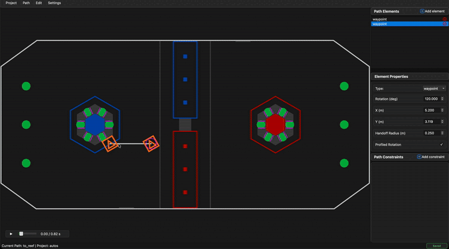
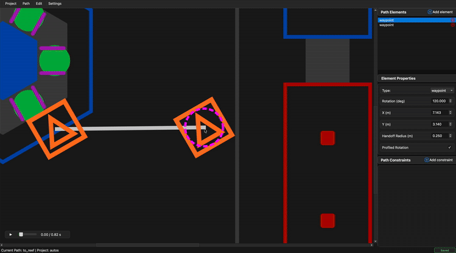
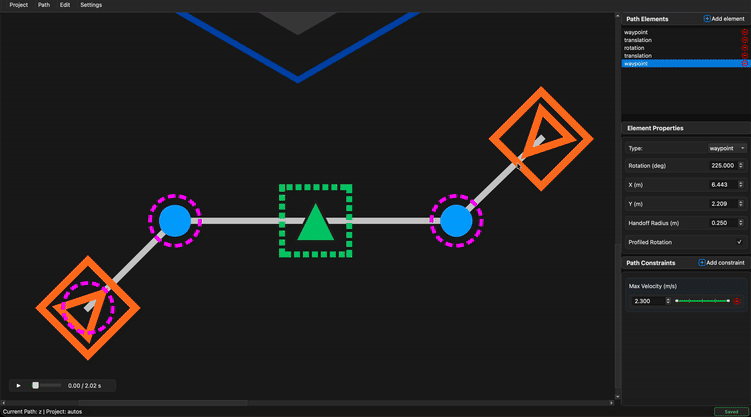
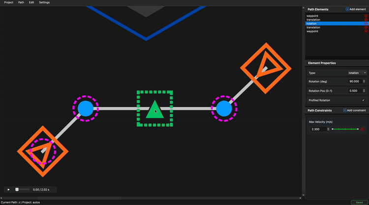
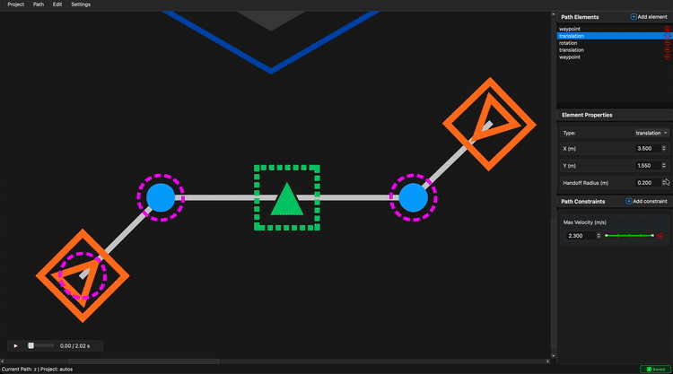
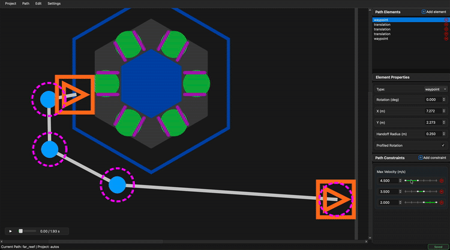

# Canvas

The canvas is the main visual workspace. It displays the FRC field with your path drawn on top and lets you directly manipulate path elements — drag to reposition, rotate handles for heading, click to select.

## Navigation

### Zoom

Use the **scroll wheel** to zoom in and out. Zoom is centered on the mouse cursor.

### Pan

**Click and drag on empty field space** to pan the view. Clicking on an element selects it instead, so pan works as long as your initial click isn't on top of anything.

## Selecting elements

Click an element to select it. The selected element animates a selection indicator (v0.4.0+) and its properties appear in the sidebar. Clicking **empty field space** clears the selection.

Selection is preserved across drag, reorder, undo, and redo operations so you don't lose your place while editing.

## Moving elements

Drag a **Waypoint** or **TranslationTarget** by its body to reposition it on the field. The sidebar's X/Y properties update live while you drag.

## Adjusting rotation

Waypoints and RotationTargets have **rotation handles** — arrows extending from the element pointing in the current heading direction. Drag a handle to change the rotation. The sidebar's degree display updates live.

## Moving rotation targets along a segment

A RotationTarget lives on the line between two translation elements. Drag it along that line to change its `t_ratio` — the position along the segment where the rotation is achieved.

Dragging is constrained to the segment — you can't move a RotationTarget off its line. To move a RotationTarget to a different segment, either reorder it in the sidebar list or change the surrounding translation elements.

## Path visuals

### Line between translation elements

The straight line connecting consecutive translation elements is the **path segment** — the nominal line the robot will follow. Rotation targets and event triggers appear as markers along this line.

### Handoff radius

A **magenta dashed circle** is drawn around each translation element. When the robot enters this circle, `FollowPath` advances to the next translation target.

Radii can be set per-element (sidebar → **Handoff Radius (m)**) or globally (**Settings → Edit Config…** → **Default Handoff Radius**).

### Constraint overlay

Click a ranged constraint in the sidebar's **Path Constraints** section and the canvas paints a **green overlay** over the segments the constraint applies to. This is the visual confirmation for which ordinals a given constraint covers.

### Protrusions (optional)

If protrusions are enabled in project config, waypoint and rotation-target elements render a **dashed offset perimeter** on the chosen side (left, right, front, or back). Waypoint protrusions are dashed orange; rotation-target protrusions are dashed green. The main element perimeter is unchanged. See [Protrusions](protrusions.md).

## Simulation view

When you press Play, the canvas shows:

- **Simulated robot** moving along the path, respecting constraints.
- **Robot footprint** (from the Robot Length / Robot Width config fields).
- **Protrusions** if enabled — their visibility respects Default Protrusion State plus any Show/Hide event keys that fire during sim.
- **Rotation** indicated by the robot's orientation.

See [Simulation](simulation.md) for what the sim does and doesn't model.

## Keyboard shortcuts

| Shortcut | Action |
|----------|--------|
| `Delete` / `Backspace` | Delete the selected element |
| `Space` | Play / pause simulation |
| `Ctrl/Cmd + Z` | Undo |
| `Ctrl/Cmd + Y` / `Ctrl/Cmd + Shift + Z` | Redo |
| `Ctrl/Cmd + S` | Save current path |

Segment-bar shortcuts (arrow keys, `S` to split) are covered in [Sidebar](sidebar.md#keyboard-shortcuts-in-the-segment-bar).

## Recent changes

- **v0.5.0** — Added animated selection indicator throughout canvas items (waypoints, translations, rotation targets, event triggers).
- **v0.4.0** — Clicking empty field space now clears selection. Drag/rotation undo no longer creates spurious move entries for simple clicks.
- **v0.3.0** — Simulated robot footprint changes size as protrusions toggle during sim playback.
