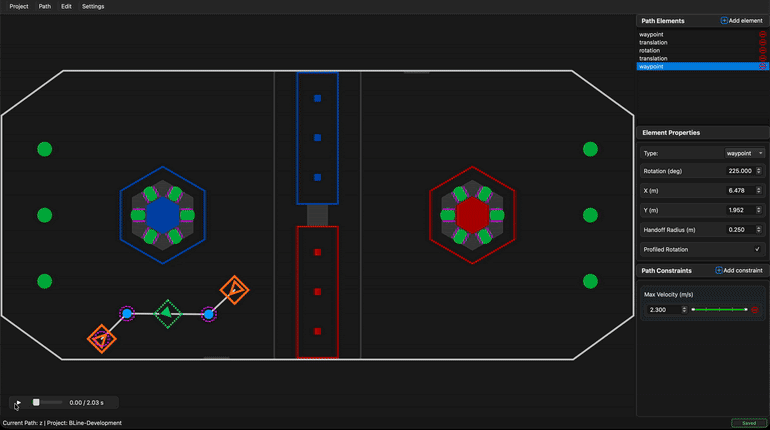

# GUI Overview

BLine-GUI is a visual path editor for designing autonomous routines. It writes JSON files in your robot project's `deploy/autos/` directory, which BLine-Lib loads at runtime. Paths can be iterated visually, simulated for rough timing and trajectory preview, and versioned in Git like any other source file.



The current release is **BLine-GUI v0.5.0**, which added macOS binaries, a new constraint editing experience, and a revamped selection/editor workflow.

## Launching

| Install method | How to start |
|----------------|--------------|
| Prebuilt binary (Windows / macOS / Linux) | Start Menu, Applications folder, or double-click the executable |
| Source install (pip/pipx) | Run `bline` from a terminal |

See [Installation](../getting-started/installation.md#bline-gui) if you haven't installed it yet. To create a desktop shortcut when using the source install, run `bline --create-shortcut`.

## Interface layout


| Area | Purpose |
|------|---------|
| **Menu bar** (top) | Project management, path operations, edit actions, settings. See [Menu Bar](menu-bar.md). |
| **Canvas** (center) | The field with your path drawn on top. Drag elements, zoom/pan, scrub simulation. See [Canvas](canvas.md). |
| **Sidebar** (right) | Element list, per-element properties, path constraints. See [Sidebar](sidebar.md). |
| **Transport controls** (bottom-left of canvas) | Play/pause simulation + timeline scrubber. See [Simulation](simulation.md). |

## Project structure

BLine-GUI operates on a **project directory** — any directory containing a `config.json` and a `paths/` subfolder. The idiomatic layout is to point it at your robot project's `src/main/deploy/autos`:

```
src/main/deploy/autos/
├── config.json         # Global constraints, robot footprint, protrusion settings
└── paths/
    ├── scoreFirst.json
    ├── toIntake.json
    └── ...
```

Every file in `paths/` is a single path. BLine-Lib loads them by name (without the `.json` extension):

```java
Path scoreFirst = new Path("scoreFirst");
```

!!! tip "Open your FRC project directly"
    Open the `autos/` directory inside your robot project (not a separate folder). The JSONs that the GUI writes are the same JSONs BLine-Lib reads on the robot. No copy step.

## Element colors on the canvas

| Color | Element |
|-------|---------|
| 🟠 Orange rectangle + rotation handle | **Waypoint** (position + rotation) |
| 🔵 Blue circle | **TranslationTarget** (position only) |
| 🟢 Green dashed rectangle + rotation handle | **RotationTarget** (rotation only) |
| 🟡 Yellow line marker | **EventTrigger** (action at a t_ratio) |
| 🟣 Magenta dashed circle around translation elements | **Handoff radius** |
| 🟢 Green overlay | **Ranged constraint domain** (shown when slider focused) |
| 🟧 Dashed orange/green offsets around waypoints/rotation targets | **Protrusions** (if enabled). See [Protrusions](protrusions.md). |

## Typical workflow

1. **Open your project** (**Project → Open Project…**), pointed at `src/main/deploy/autos`.
2. **Configure the robot** (**Settings → Edit Config…**): robot size, kinematic defaults, optional protrusions.
3. **Create or open a path** from the **Path** menu.
4. **Add path elements** — click **Add element** in the sidebar or use the canvas.
5. **Position and rotate** elements by dragging them on the canvas.
6. **Add ranged constraints** in the sidebar's **Path Constraints** section for per-section velocity/acceleration limits.
7. **Preview** using the transport controls at the bottom-left of the canvas.
8. **Save** — the GUI writes the JSON on save, so your path is immediately available to robot code.

## Keyboard shortcuts

| Shortcut | Context | Action |
|----------|---------|--------|
| `Ctrl/Cmd + Z` | Global | Undo |
| `Ctrl/Cmd + Y` / `Ctrl/Cmd + Shift + Z` | Global | Redo |
| `Ctrl/Cmd + S` | Global | Save current path |
| `Space` | Canvas focus | Play / pause simulation |
| `Delete` / `Backspace` | Element selected | Remove the selected element |
| `←` / `→` | Constraint segment focused | Navigate between segments on a ranged constraint |
| `Delete` / `Backspace` | Constraint segment focused | Delete the selected constraint segment |
| `S` | Constraint segment focused | Split the selected constraint segment at its midpoint |

The segment-bar shortcuts were added in v0.5.0 alongside the new constraint editor. The arrow/Delete behavior also works inside the pop-out constraint editor.

## What was recently added

Highlights since the initial BLine-GUI release:

- **v0.5.0 — macOS support + constraint editor overhaul.** First macOS `.dmg` (Apple Silicon). Introduces the `SegmentBar` widget, pop-out constraint editor, sharper sidebar typography, and segment-bar keyboard shortcuts.
- **v0.4.0 — Selection clarity.** Animated selection indicator on the canvas. Better sync between canvas/sidebar selection. Clicking empty field space clears selection. Drag/reorder/undo preserve selection more reliably.
- **v0.3.0 — Protrusions.** New per-element protrusion rendering (left/right/front/back/none) with event-trigger-driven show/hide. Reorganized config dialog. See [Protrusions](protrusions.md).

For the full release history, see the [Chief Delphi thread](https://www.chiefdelphi.com/t/introducing-bline-a-new-rapid-polyline-autonomous-path-planning-suite/509778) or the [BLine-GUI releases page](https://github.com/edanliahovetsky/BLine-GUI/releases).

## Learn more

- [Menu Bar](menu-bar.md) — project, path, edit, settings menus.
- [Canvas](canvas.md) — zoom/pan, dragging, rotation handles, selection.
- [Sidebar](sidebar.md) — element properties, constraint editor, segment bar.
- [Simulation](simulation.md) — previewing robot motion and reading the timeline.
- [Protrusions](protrusions.md) — visualizing bumpers, intakes, and appendages.
