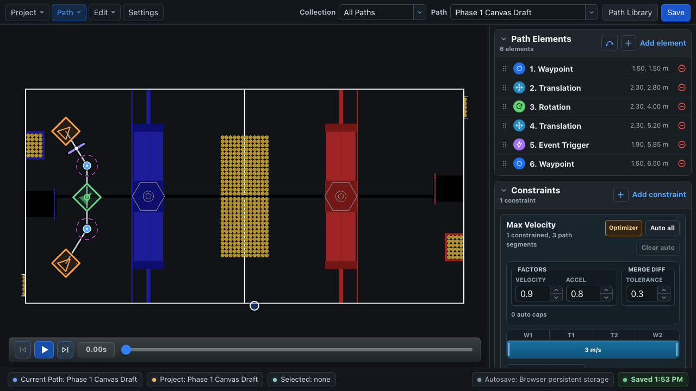

# BLine Web Overview

BLine Web is the current editor for browser and desktop workflows. It replaces the legacy PySide BLine-GUI in all current tutorials.



## Interface map

| Area | Purpose |
| --- | --- |
| **Project / Path / Edit / Settings** | Workspace transfer, path management, undo/redo, and project configuration |
| **Collection and Path selectors** | Filter related paths and switch the active path |
| **Canvas** | Current FRC field, active path, collection overlays, linked elements, footprint, and direct manipulation |
| **Path Elements** | Ordered element list plus add-curve and add-element actions |
| **Element Properties** | Coordinates, rotation, handoff radius, event key, and linked-element controls for the selection |
| **Constraints** | Path tolerance and ranged min/max velocity/acceleration controls plus optimizer actions |
| **Transport** | Reset, play/pause, fast-forward, and timeline scrubbing for idealized simulation |
| **Status bar** | Current path/project, selection, storage target, autosave state, and errors |

## Projects and runtime files

A BLine Web project contains shared configuration, multiple paths, collections, linked-element metadata, and optional custom field assets.

The robot-facing portion is still simple:

```text
autos/
├── config.json
└── paths/
    ├── score-one.json
    └── collect-and-return.json
```

The editor stores collections, linked-element identities, and other editor-only state under `.bline-web/` when exporting or using desktop folder storage. Browser autos exports and project archives preserve the same identities. BLine-Lib loads the individual runtime JSON files and does not load editor organization or rerun the optimizer.

## Browser and desktop are different storage surfaces

=== "Browser"

    Projects persist in browser storage. **Save** updates that browser workspace. Export an autos folder to move files into the robot repository and export a project archive for a portable complete backup.

=== "Desktop"

    The app can open the robot repository or `src/main/deploy/autos` and write the project there. Autosave is deferred while canvas interaction is active, then writes after the edit.

Always read the storage label and **Saved** state in the lower-right status area before closing or deploying.

## Recommended editor workflow

1. Open or create the project.
2. Configure robot dimensions, path defaults, field, and optimizer settings.
3. Create a path and add anchor elements.
4. Draw/edit geometry and rotation.
5. Add local constraints or review optimizer output.
6. Preview structure and event timing.
7. Save, export when needed, and verify the runtime files.
8. Test in WPILib simulation and on the robot with logs.

## Learn the editor by task

- [Projects, Paths & Collections](menu-bar.md)
- [Draw & Edit Paths](canvas.md)
- [Constraints & Optimizer](sidebar.md)
- [Linked Elements](linked-elements.md)
- [Simulation](simulation.md)
- [Fields, Footprint & Protrusions](protrusions.md)
- [Import, Export & Backups](exporting.md)

For an end-to-end walkthrough, use the [First Path Tutorial](../getting-started/quick-start.md) instead of reading these reference pages in order.
