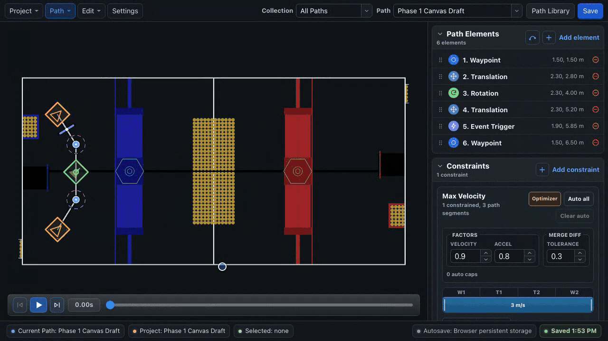
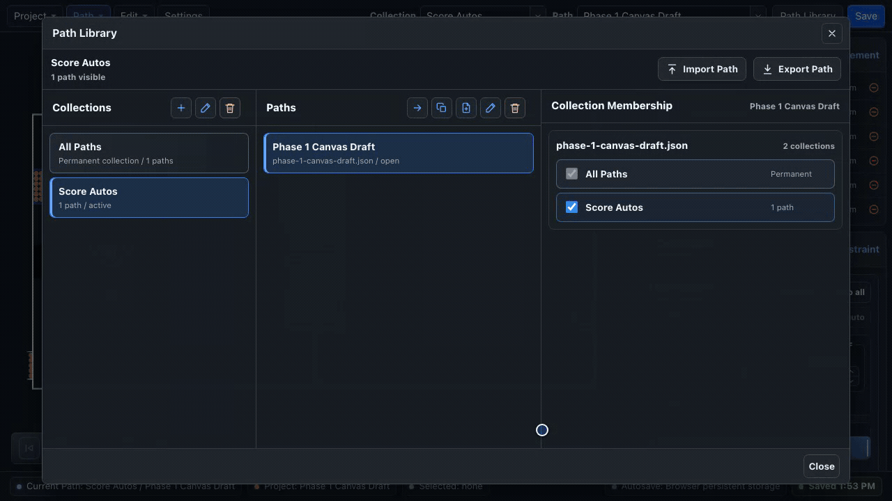

# Projects, Paths & Collections

Use a **project** for one robot/team configuration, a **path** for one runtime movement file, and a **collection** to group related paths in the editor.

## The hierarchy

```text
Project
├── shared config
├── linked elements
├── Collection: Center Autos
│   ├── leave-start
│   └── collect-center
├── Collection: Source-Side Autos
│   ├── leave-start
│   └── collect-source
└── All Paths (permanent view)
```

A path can belong to multiple collections. Collections are filters, not filesystem folders; deleting a collection can keep its paths in **All Paths**.

## Create or open a project

The **Project** menu adapts to the environment.

=== "Browser"

    - **New Project** creates a browser-persisted workspace.
    - **Open Project…** opens another saved browser workspace.
    - **Delete Projects…** removes selected browser workspaces.
    - Import/export actions move data across the browser boundary.

=== "Desktop"

    - **Open Project Folder…** selects an existing repository or `autos` folder.
    - **Create Project Folder…** creates a folder-backed project.
    - Recent folders reopen direct storage targets.

When given a robot repository containing `src/main/deploy`, the desktop app resolves it to `src/main/deploy/autos`.

## Create and manage paths

Use **Path → Manage Paths** to:

- create a blank path;
- save the active path as a copy;
- rename it; or
- delete one or more paths.

The toolbar's **Path** selector switches within the selected collection. Choose **All Paths** in the **Collection** selector when a path seems to be missing.

The runtime filename ends in `.json`. BLine-Lib loads it without the extension:

```java
Path collectCenter = new Path("collect-center");
```

## Use the Path Library

Open **Path Library** from the toolbar or Path menu. The dialog has three working areas:

1. **Collections** — choose, create, rename, or delete a group.
2. **Paths in selected collection** — open, duplicate, or delete a path.
3. **Collection membership** — add the selected path to one or more collections.

{ .gif-demo data-gif-source="/assets/gifs/web/path-collections.gif" data-gif-poster="/assets/images/gif-posters/path-collections-start.png" data-gif-end="/assets/images/gif-posters/path-collections-end.png" data-gif-duration="7910" }
{ .gif-print-poster }

### Collection overlays

When a collection is selected, its other paths appear as muted outlines on the field. Hover an outline to identify it; click it to switch the active path. This is useful for checking shared starts, handoffs, and crowded autonomous routes without merging them into one path.

## Save and autosave

The lower-right status reports the storage target and state:

- **Browser persistent storage** or direct folder access;
- autosave pending/saving;
- saved time; or
- an error.

Autosave waits while a canvas drag is active, then writes after the interaction. `Ctrl/Cmd + S` or **Save** forces a save of the current workspace.

!!! warning "Save is not always deploy"
    Browser Save updates browser storage. It does not write into the robot repository. Use [Export Autos Folder](exporting.md#export-an-autos-folder) for that transfer.

## Undo and redo

`Ctrl/Cmd + Z` and redo cover path geometry, properties, constraints, collection membership, and other content edits. Selecting a row does not create a history entry.

After a destructive library edit, verify the active path and collection before continuing; undo can restore content, but it is easier to catch a mistaken deletion immediately.

## Project data versus runtime data

| Data | Used by BLine-Lib | Editor-only |
| --- | ---: | ---: |
| `config.json` kinematic defaults | Yes | No |
| `paths/*.json` | Yes | No |
| Collections | No | Yes |
| Linked-element identities | No | Yes |
| Robot footprint/protrusion rendering | No | Yes |
| Custom field image and selection | No | Yes |
| Optimizer settings and automatic ranged-constraint metadata | No | Yes |

Export a project archive before major restructuring.

## Next

- [Draw & Edit Paths](canvas.md)
- [Linked Elements](linked-elements.md)
- [Import, Export & Backups](exporting.md)
