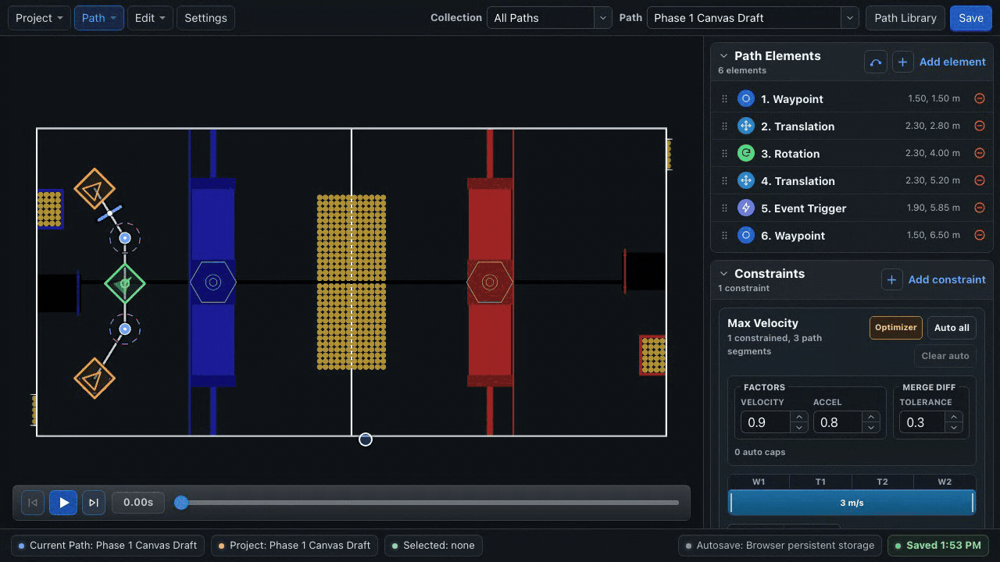

# Constraints & Optimizer

The **Constraints** section contains path-specific tolerances and ranged motion limits. Use it after the basic geometry is correct.

## Add a constraint

Choose **Add constraint** and select:

- Max Velocity or Max Acceleration
- Min Velocity
- Max Rot Velocity or Max Rot Acceleration
- Min Rot Velocity
- End Translation Tolerance
- End Rotation Tolerance

End tolerances are one scalar for the path. Velocity and acceleration constraints use ordinal ranges.

## Read the range bar

The cells above a range use editor ordinals starting at **1**. Translation cards count waypoints and translation targets; rotation cards count waypoints and rotation targets. Event triggers are not part of either constraint ordinal track.

Each cell either shows a ranged value or remains **Open**. For maximum constraints, Open falls back to the matching global default. For minimum constraints, which have no global baseline, Open resolves to `0`.

!!! warning "Exported ordinals are zero-based"
    The editor's first ordinal is `1`; runtime JSON and Java call it `0`. Let BLine Web serialize ranges instead of transcribing the screen numbers by hand.

## Edit ranges

| Task | Action |
| --- | --- |
| Select a range | Click its colored bar or cell |
| Change its value | Enter a value in the selected-range control |
| Extend/shrink it | Drag a range boundary across cells |
| Split it | Select it and choose **Split** |
| Add a range | Choose **+**, or insert into an open gap |
| Delete one range | Select it and use the delete action or `Delete`/`Backspace` |
| Use a larger surface | Choose **Editor** to open the movable modeless Constraint Editor |

Dragging or editing an automatic range converts it to **Manual**, because the value no longer represents the optimizer output.

The editor warns when a maximum is above the global value or a minimum is above the paired maximum. Resolve warnings rather than assuming the runtime will clamp them as intended.

## Use the path optimizer

The optimizer proposes **maximum translation velocity** caps from path geometry and current settings.

{ .gif-demo data-gif-poster="/assets/images/gif-posters/auto-velocity-optimizer-start.png" data-gif-end="/assets/images/gif-posters/auto-velocity-optimizer-end.png" data-gif-duration="7410" }
{ .gif-print-poster }

1. Open the Max Velocity card.
2. Review the **Optimizer** settings.
3. Choose **Auto all** to fill eligible open segments.
4. Inspect the generated ranges and their coverage.
5. Simulate the path.
6. Test on the robot and convert/edit any range that needs manual control.

**Clear auto** removes automatic ranges only. Manual ranges survive optimizer reruns.

### Optimizer settings

| Setting | Current default | Meaning |
| --- | ---: | --- |
| Velocity factor | `0.9` | Safety factor applied to candidate velocity caps |
| Acceleration factor | `0.8` | Headroom applied while estimating achievable changes |
| Merge difference | `0.3 m/s` | Similar adjacent caps within this difference may be merged |

These are editor defaults, not measured robot limits. Tune the project defaults and factors to your chassis and testing process.

## Refresh stale automatic ranges

Automatic caps can become stale after changes to:

- anchor geometry;
- handoff radii;
- rotation elements or rotation limits;
- project path defaults; or
- optimizer factors.

Refresh the optimizer after those changes. A stale marker means “this value was generated from older inputs,” not that the path is necessarily unsafe or safe.

## Optimizer limitations

The optimizer is a geometry-based authoring assistant. It does not model the complete drivetrain, voltage, center of mass, wheel friction, carpet, battery state, pose noise, game-piece contact, or mechanism motion.

!!! warning "Review every generated cap"
    Automatic does not mean validated. Use the optimizer to reduce repetitive first-pass work, then confirm range placement, simulate structure, inspect robot logs, and keep manual caps where field behavior requires them.

## Minimum velocity constraints

The UI marks minimum constraints as advanced. They can overcome static friction when PID output is too small outside the final tolerance, but they can also force overshoot.

- Start with no minimum.
- Tune controllers and inspect measured speed first.
- Add the smallest baseline that fixes a demonstrated deadband problem.
- Keep it below the active maximum.
- Re-test the endpoint at full configured speed.

## A repeatable workflow

For each difficult turn or mechanism-sensitive region:

1. Select the relevant range and confirm its highlighted path section.
2. Write down the current value and symptom.
3. Change one range or factor.
4. Re-run simulation for structural sanity.
5. Run the robot and compare the same log keys.
6. Keep or revert based on evidence.

See [Constraints & Ordinals](../concepts/constraints.md) for runtime precedence and JSON form, and [Tune Your Robot](../getting-started/tuning.md) for the log workflow.
