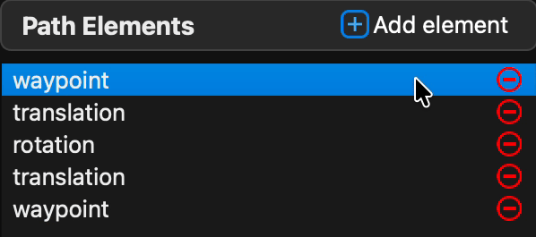
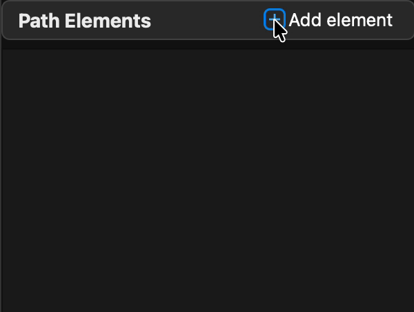
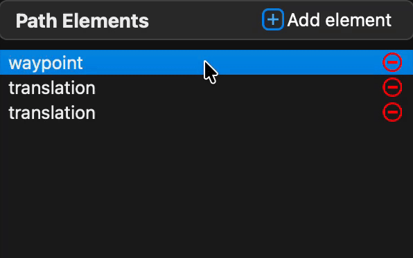
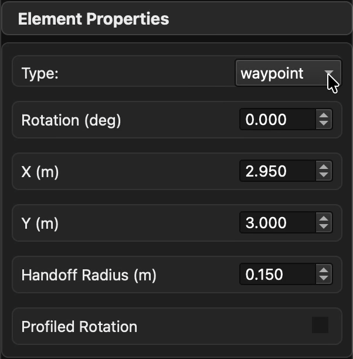
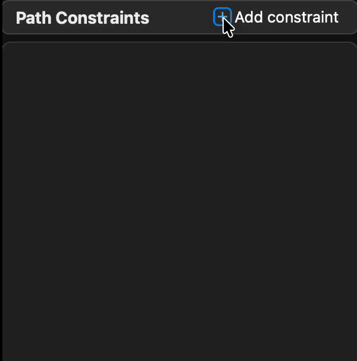
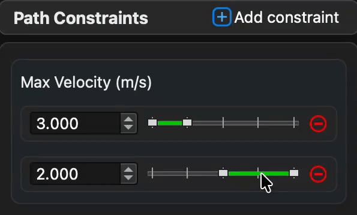

# Sidebar

The sidebar is where per-element editing and path-level constraint configuration happen. It's split into three panels: the element list, the element properties editor, and the constraint editor.

## Path Elements panel

Lists every element in the current path in order. Each row shows a colored type chip, the element type, and its key property (coordinates, rotation, or lib key). A red ⊖ button deletes the row; numeric row indices give you a quick reference for ranged-constraint ordinals.

### Add an element

Click **Add element** to insert a new element **after the currently selected one**. If nothing is selected, it's appended to the end of the path.

Newly added elements default to a sensible type based on the path's current state, but you can change the type immediately via the properties panel's **Type** dropdown.

### Reorder elements

Drag list rows to reorder them. The canvas updates instantly.

!!! note "RotationTargets are segment-scoped"
    A RotationTarget is logically "between" two translation elements. Reordering can change which segment it belongs to. The same applies to EventTriggers. Reorder consciously when these elements are in the path.

### Remove an element

Click the red ⊖ next to any row, or select it and press `Delete` / `Backspace` in the canvas or sidebar.

## Element Properties panel

Appears when an element is selected. Fields vary by element type.

### Type dropdown

All elements expose a **Type** dropdown that converts between types:

- **Waypoint ↔ TranslationTarget** — adds or removes the rotation data.
- **Waypoint ↔ RotationTarget** — adds or removes the translation data.
- **TranslationTarget ↔ RotationTarget** — swaps translation for rotation.
- **↔ EventTrigger** — replaces with an event trigger (resets fields).

### Translation properties

For Waypoints and TranslationTargets:

| Field | Description |
|-------|-------------|
| **X (m)** | Field-coordinate x in meters. |
| **Y (m)** | Field-coordinate y in meters. |
| **Handoff Radius (m)** | Radius at which the follower advances from this target. Leave at 0 to inherit the global default. |

### Rotation properties

For Waypoints and RotationTargets:

| Field | Description |
|-------|-------------|
| **Rotation (deg)** | Holonomic heading target in degrees. |
| **Profiled Rotation** | When checked, the rotation interpolates from the previous target across the segment. When unchecked, the setpoint snaps. |

For standalone RotationTargets there's also:

| Field | Description |
|-------|-------------|
| **t_ratio** | Position along the segment (0.0 – 1.0) where the rotation target is evaluated. Also adjustable by dragging the target on the canvas. |

### Event-trigger properties

For EventTriggers:

| Field | Description |
|-------|-------------|
| **Event Pos (0–1)** | The `t_ratio` along the segment at which the trigger fires. |
| **Lib Key** | The string key your robot code registered an action under via `FollowPath.registerEventTrigger(...)`. |

See [Event Triggers](../concepts/event-triggers.md) for the full model and patterns.

## Path Constraints panel

Configure the ranged velocity/acceleration constraints for the path. End tolerances live in project config (not here).

### Add a constraint

Click **Add constraint**, choose the type (max translational velocity, max translational acceleration, max rotational velocity, max rotational acceleration), and pick a value.

### Constraint rows (v0.5.0 SegmentBar)

Each constraint is rendered as a **SegmentBar**: a horizontal bar with one colored segment per range, with value labels on top and drag handles between them. The ordinal axis on the bar corresponds to the translation or rotation ordinal sequence of the path (depending on which constraint type you're editing).

| Action | How |
|--------|-----|
| **Adjust a value** | Click inside the segment and edit the value label inline, or drag its SpinBox. |
| **Resize a range** | Drag the handle between two segments left or right. |
| **Add a new range** | Click **+ Add** next to the bar, or split an existing segment (see shortcuts below). |
| **Delete a range** | Click its **×** button or select it and press `Delete` / `Backspace`. |
| **Navigate between segments** | Click a segment, then use `←` / `→`. |

### Pop-out constraint editor (v0.5.0)

For paths with many constraints, open the **pop-out constraint editor** via the icon on the right side of the constraint section header. The pop-out window gives you a larger editing surface for all constraints simultaneously, with the same SegmentBar widgets. Edits sync bidirectionally with the sidebar in real time.

The pop-out also honors standard undo/redo (`Ctrl/Cmd + Z` / `Ctrl/Cmd + Shift + Z`).

### Visual feedback on the canvas

Click any constraint segment to highlight the **segments of the path** that constraint covers with a green overlay on the canvas. This is the fastest way to confirm an ordinal range matches what you intended.

### Removing a constraint

Click the red ⊖ on a constraint row to remove all of its ranges at once. To delete a single range within a constraint, use the per-segment × or `Delete` shortcut.

## Keyboard shortcuts in the segment bar

With a constraint segment focused (click it first):

| Shortcut | Action |
|----------|--------|
| `←` / `→` | Navigate between adjacent segments |
| `Home` / `End` | Jump to first / last segment |
| `Delete` / `Backspace` | Delete the focused segment |
| `S` | Split the focused segment at its midpoint |

Also works inside the pop-out editor.

## Recent changes

- **v0.5.0** — Introduced `SegmentBar` constraint widget, pop-out editor, indexed list items, adaptive-height sidebar, inline units, and tooltips.
- **v0.5.0 under the hood** — Ordinal remapping keeps ranged constraints correct when path structure changes; EventTrigger elements are now properly counted against the rotation ordinal sequence on project load.
- **v0.4.0** — Clicking empty space clears selection. Drag/rotation undo no longer records redundant entries for simple clicks.
