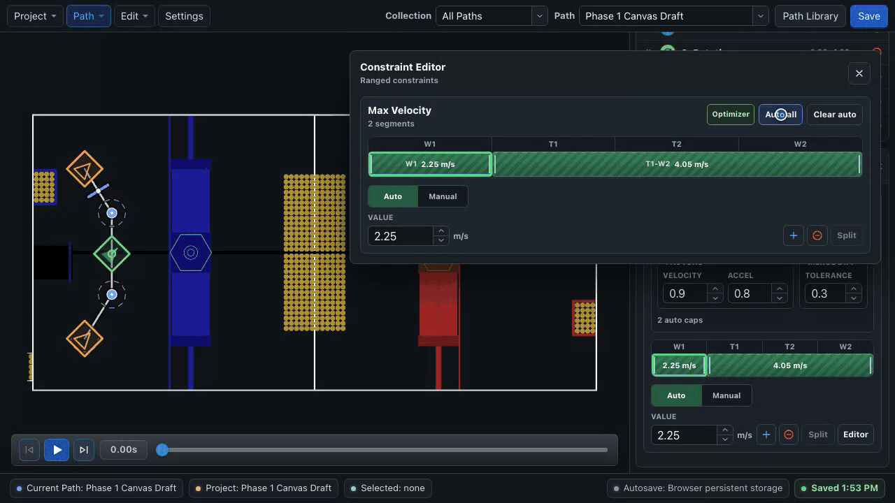

# Constraints & Optimizer

The **Constraints** section turns path geometry into a practical velocity plan. Maximum translation velocity is the main authoring control: it determines how quickly the robot may approach each anchor, corner, clearance, and endpoint.

## Use constraints while creating the path

For a normal path:

1. Draw the geometry.
2. Identify the open travel, turns, narrow clearances, and precision approaches.
3. Run the maximum-velocity optimizer.
4. Review the proposed ranged constraints and edit them where the optimizer lacks robot or game-task context.
5. Simulate the result.
6. Test the path incrementally on the robot.

Do not postpone velocity planning until the path fails on the robot. Geometry and local maximum velocity work together: geometry selects the route, while the caps determine how aggressively BLine follows it.

## Add a constraint

Choose **Add constraint** and select:

- Max Velocity or Max Acceleration
- Max Rot Velocity or Max Rot Acceleration
- End Translation Tolerance
- End Rotation Tolerance
- Min Velocity or Min Rot Velocity (advanced)

End tolerances are one scalar for the path. Velocity and acceleration constraints use ordinal ranges.

## Read the range bar

The cells above a range use editor ordinals starting at **1**. Translation cards count waypoints and translation targets; rotation cards count waypoints and rotation targets. Event triggers are not part of either constraint ordinal track.

Each cell either shows a ranged value or remains **Open**. For maximum constraints, Open falls back to the matching global default. For minimum constraints, which have no global baseline, Open resolves to `0`.

!!! warning "Exported ordinals are zero-based"
    The editor's first ordinal is `1`; runtime JSON and Java call it `0`. Let BLine Web serialize ranges instead of transcribing the screen numbers by hand.

## Edit ranges

| Task | Action |
| --- | --- |
| Select a range | Click its colored bar or cell |
| Change its value | Enter a value in the selected-range control |
| Extend/shrink it | Drag a range boundary across cells |
| Split it | Select it and choose **Split** |
| Add a range | Choose **+**, or insert into an open gap |
| Delete one range | Select it and use the delete action or `Delete`/`Backspace` |
| Use a larger surface | Choose **Editor** to open the movable modeless Constraint Editor |

Dragging or editing an automatic ranged constraint converts it to **Manual**, because the value no longer represents the optimizer output.

The editor warns when a maximum is above the global value or a minimum is above the paired maximum. Resolve warnings rather than assuming the runtime will clamp them as intended.

## Use the path optimizer

The optimizer proposes **maximum translation velocity** caps from path geometry and current settings. It is the normal starting point for a velocity plan, not merely a repair tool for difficult paths.

{ .gif-demo data-gif-source="/assets/gifs/web/auto-velocity-optimizer.gif" data-gif-poster="/assets/images/gif-posters/auto-velocity-optimizer-start.png" data-gif-end="/assets/images/gif-posters/auto-velocity-optimizer-end.png" data-gif-duration="7410" }
{ .gif-print-poster }

1. Open the Max Velocity card.
2. Review the **Optimizer** settings.
3. Choose **Auto all** to fill eligible open segments.
4. Inspect the generated ranged constraints and the field sections they cover.
5. Adjust caps for mechanisms, clearances, pickup stability, or scoring approaches the geometry alone cannot describe.
6. Simulate the path.
7. Test on the robot and convert or edit any ranged constraint that needs manual control.

**Clear auto** removes automatic ranged constraints only. Manual ranged constraints survive optimizer reruns.

### Optimizer settings

| Setting | Current default | Meaning |
| --- | ---: | --- |
| Velocity factor | `0.9` | Safety factor applied to candidate velocity caps |
| Acceleration factor | `0.8` | Headroom applied while estimating achievable changes |
| Merge difference | `0.3 m/s` | Similar adjacent caps within this difference may be merged |

These are editor defaults, not measured robot limits. Tune the project defaults and factors to your chassis and testing process.

## Refresh stale automatic ranged constraints

Automatic caps can become stale after changes to:

- anchor geometry;
- handoff radii;
- rotation elements or rotation limits;
- project path defaults; or
- optimizer factors.

Refresh the optimizer after those changes. A stale marker means “this value was generated from older inputs,” not that the path is necessarily unsafe or safe.

## Optimizer limitations

The optimizer is a geometry-based authoring assistant. It does not model the complete drivetrain, voltage, center of mass, wheel friction, carpet, battery state, pose noise, game-piece contact, or mechanism motion.

!!! warning "Review every generated cap"
    Automatic does not mean validated. Use the optimizer to reduce repetitive first-pass work, then confirm ranged-constraint placement, simulate structure, inspect robot logs, and keep manual caps where field behavior requires them.

## Minimum velocity constraints

The UI marks minimum constraints as advanced because they deliberately reshape the controller's low-output domain. They are not needed for ordinary path creation.

- Start with no minimum.
- Tune the controllers and shape the path with maximum-velocity ranged constraints first.
- Consider a minimum only for an intentional nonzero arrival into a chained path, endpoint-domain shaping, or another tested edge case.
- Add the smallest floor that produces the intended behavior.
- Keep it below the active maximum.
- Re-test the entire endpoint and command transition at the configured path speed.

`FollowPath` disables the minimum after the corresponding error enters tolerance and sends zero speeds when the command ends. A minimum can make the robot enter that tolerance with nonzero motion, but it does not by itself guarantee continuous velocity between commands.

## A repeatable workflow

For each difficult turn or mechanism-sensitive region:

1. Select the relevant ranged constraint and confirm its highlighted path section.
2. Identify whether the problem is route geometry, maximum velocity, handoff behavior, or a robot-control issue.
3. Change one ranged constraint, anchor, or optimizer factor.
4. Re-run simulation for structural sanity.
5. Run the robot under the same test conditions.
6. Keep or revert the change based on the observed behavior.

See [Constraints & Ordinals](../concepts/constraints.md) for the authoring mental model, runtime precedence, and JSON form. Tune the three controllers before using path constraints to compensate for a control problem; see [Tune Your Robot](../getting-started/tuning.md).
