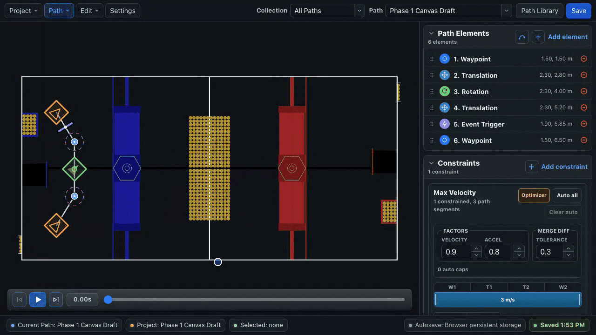
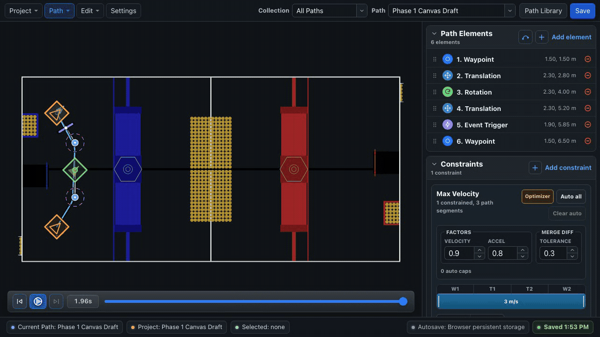

# Simulation

BLine Web provides an idealized kinematic preview for checking path structure, rotation timing, constraints, marker placement, protrusion state, and footprint clearance.

{ .gif-demo data-gif-source="/assets/gifs/web/simulation-playback.gif" data-gif-poster="/assets/images/gif-posters/simulation-playback-start.png" data-gif-end="/assets/images/gif-posters/simulation-playback-end.png" data-gif-duration="6830" }
{ .gif-print-poster }

## Transport controls

| Control | Action |
| --- | --- |
| Reset | Return to the beginning |
| Play / Pause | Start or stop playback |
| Fast forward | Jump to the end |
| Timeline | Scrub to a specific time |

When no dialog, menu, input, or other interactive control has keyboard focus:

- `Space` or `K` toggles play/pause.
- `Left Arrow` or `Home` returns to the beginning.
- `Right Arrow` or `End` jumps to the end.

## What the preview models

The simulator uses the path's:

- translation and rotation elements;
- global/path velocity and acceleration constraints;
- handoff radii and `t_ratio` targets;
- robot footprint; and
- an editor-only protrusion schedule derived from show/hide event-key positions.

Use it to answer:

- Did I order the elements correctly?
- Does the robot rotate during the intended segment?
- Does the slowdown cover the intended anchors?
- Are event markers placed at the intended segment positions?
- Does the protrusion preview change at the intended geometric point?
- Does the idealized footprint intersect a field feature?

## What it does not model

The editor preview is not a WPILib physics simulation and does not use the robot's three PID controllers. It does not model:

- swerve-module steering or velocity loops;
- wheel slip, current limits, battery sag, or carpet;
- center of mass or mechanism motion;
- pose-estimator noise and latency;
- collisions, game pieces, or another robot;
- controller gain quality;
- BLine-Lib event iteration, WPILib command scheduling, or subsystem requirements; or
- the exact runtime end behavior under measured momentum.

For a path with no rotation target, the Web preview initially points along the first segment. BLine-Lib instead holds the live starting heading as its fallback. Add an explicit waypoint/rotation target whenever orientation or footprint clearance matters.

!!! warning "A clean preview is not a robot validation"
    The preview can reject obvious structural mistakes, but it cannot prove timing, accuracy, or dynamic feasibility. Run WPILib simulation where available, then validate with conservative robot constraints and logs.

## A three-stage validation loop

1. **Editor:** check geometry, element order, ranged constraints, rotations, marker placement, protrusion preview, and footprint.
2. **WPILib simulation:** exercise actual robot code, command scheduling, pose reset, transforms, and logging.
3. **Robot:** validate localization, module response, traction, endpoint behavior, and safety.

If the editor and robot differ, start with the live pose, coordinate frames, active constraints, and measured drivetrain speed—not by forcing the editor preview to match.

## Use the timeline for marker and protrusion review

Scrub just before and after each event marker to inspect its geometric placement and any editor protrusion change. The protrusion preview is ordered by geometric path position; it does not reproduce BLine-Lib's path-list event cursor or WPILib command behavior. Run the actual robot event at low speed and inspect `eventTriggerElementIndex` and `eventTriggersFiredCount`.

Related: [Fields, Footprint & Protrusions](protrusions.md), [Events](../concepts/event-triggers.md), and [Logging & AdvantageScope](../lib/logging.md).
