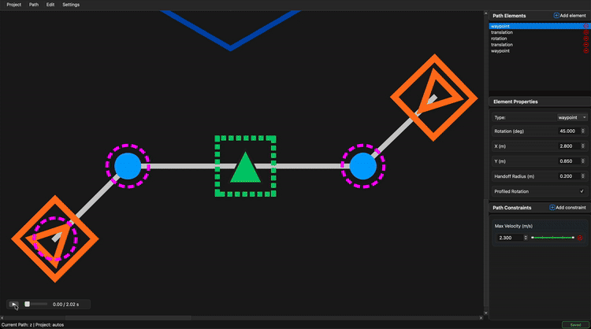

# Simulation

BLine-GUI includes a built-in simulation that previews how your robot will follow the current path. Use it for quick structural checks — does the path flow in the order you expect, do constraints land where you meant them to — before pushing to hardware.

## Transport controls

The simulation controls sit at the bottom-left of the canvas:

| Control | Function |
|---------|----------|
| **▶ / ⏸** | Play / pause simulation (`Space` on the canvas). |
| **Timeline slider** | Scrub to any point in the path. |
| **Time display** | Current time / total duration in seconds. |

Scrubbing the timeline while paused is the fastest way to inspect exactly where on the path something happens (a handoff, a rotation target, an event trigger).

## What the simulation shows

- **Simulated robot footprint** — rendered from the configured Robot Length / Robot Width in project config, rotating to match the simulated heading.
- **Trajectory trail** — orange trail along the path the sim actually walked.
- **Rotation evolution** — the footprint rotates according to profiled/non-profiled rotation targets.
- **Constraint effects** — ranged velocity caps visibly slow the footprint through their ordinal ranges.
- **Event-trigger fires** — the sim visually reacts to `show_on_event_keys` / `hide_on_event_keys` for protrusions.
- **Protrusion footprint** — if protrusions are enabled, the simulated robot footprint *changes size as protrusions toggle*, not just the dashed overlay.

## What the simulation does **not** show

!!! warning "Limitations"
    The simulation uses simplified kinematics — it is **not** a drivetrain physics simulator.

    - **No PID dynamics.** The sim doesn't run the three PID controllers; it uses a simplified `v = √(2·a·d)` profile to step along the path. Real-robot timing and behavior will differ, especially near path endpoints.
    - **Perfect traction.** No wheel slip, no battery sag, no motor limits.
    - **No disturbances.** Nothing pushes the robot; it just follows the plan.
    - **Instant acceleration response.** No motor time constants, no voltage saturation.

    The sim's total path duration is a **rough estimate**, not a precise prediction. Treat it like a wireframe preview.

For accurate dynamics, use a WPILib physics simulation with your drive code, or test on hardware.

## How to use it effectively

### Structural validation

Use the sim to confirm path structure is correct before real-robot testing:

- Do the segments connect where you expected?
- Are rotations happening at the right points in the path?
- Do constraint ranges cover the right ordinals? (Click a constraint segment — the canvas overlay confirms.)
- Do event triggers fire in the right order?

### Constraint sanity check

Play the sim while adjusting ranged velocity constraints. The simulated footprint visibly decelerates through capped ranges — if the slowdown happens in the wrong place, you've indexed the wrong ordinals.

### Identifying design smells

Things to watch for in sim:

- **Robot deceleration lingers mid-segment** — your velocity constraint range is too wide, or you want handoff radii instead.
- **Robot cuts a corner visibly** — handoff radii too large, or you need an extra TranslationTarget.
- **Rotation finishes too late (near the end of the segment)** — reduce the RotationTarget's t_ratio.
- **The sim footprint doesn't match the robot's bumper/intake geometry** — update Robot Length/Width or enable protrusions in **Settings → Edit Config…**.

## Keyboard shortcuts

| Shortcut | Action |
|----------|--------|
| `Space` (canvas focus) | Play / pause simulation |
| Drag timeline slider | Scrub |

## Next

- [Canvas](canvas.md) — reading the canvas during sim.
- [Protrusions](protrusions.md) — how the simulated footprint grows/shrinks with event triggers.
- [Tuning & Usage Tips](../usage-tips.md) — turning sim intuition into real-robot tuning.
