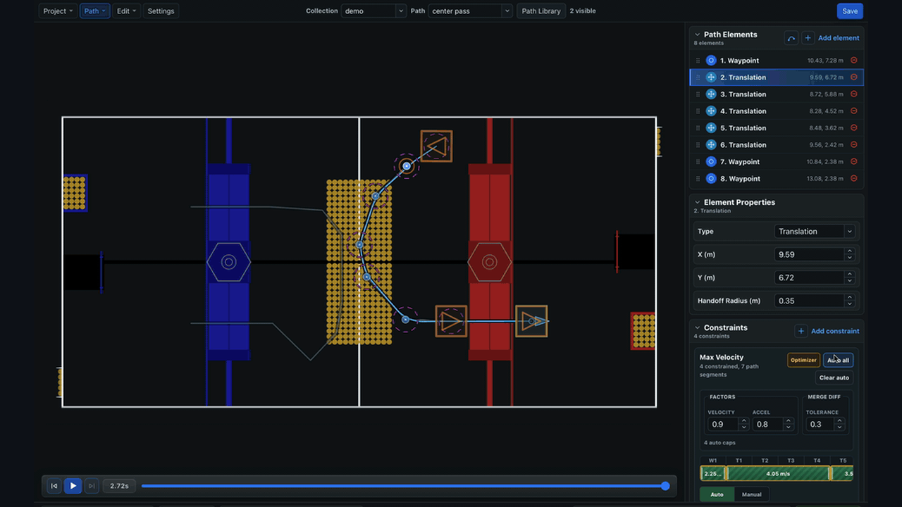
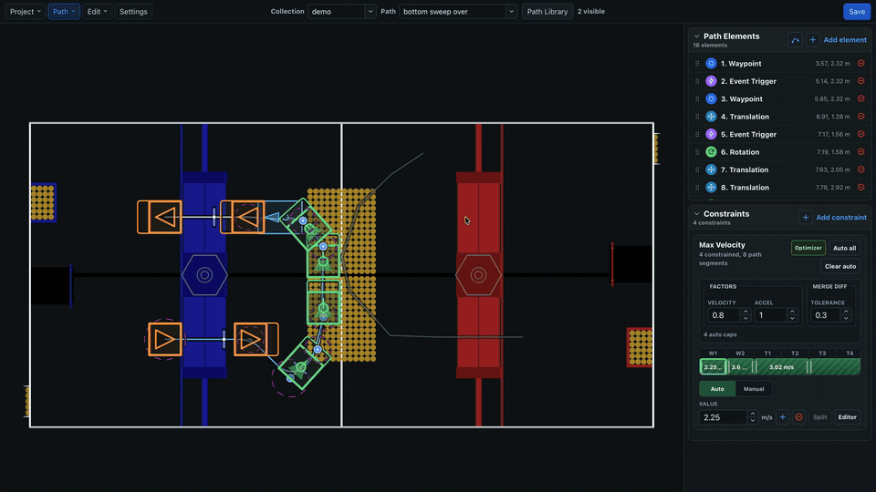

# BLine

## Build fast autos. Tune what the robot actually does.

BLine is an open-source point-to-point path planning suite for FRC holonomic drivetrains. Draw a route in BLine Web—using the hosted editor or desktop app—preview it on the current field, export robot-ready JSON, and follow it from the robot's live pose with a Java library built for rapid testing.

[Build your first BLine auto](getting-started/prerequisites.md){ .md-button .md-button--primary }
[Try BLine Web](https://bline-web.pages.dev/){ .md-button }

{ .gif-demo data-gif-source="/assets/gifs/web/homepage-simulation.gif" data-gif-poster="/assets/images/gif-posters/homepage-simulation-start.png" data-gif-end="/assets/images/gif-posters/homepage-simulation-end.png" data-gif-duration="26330" }
{ .gif-print-poster }

## Competition-tested. Recommended by teams.

In 2026, teams including **Code Orange**, **KAISER**, **Team SCREAM**, **The Blair Robot Project**, **Spartronics**, and **Smithville Tiger Trons** put BLine into real robot workflows. Here is what team members reported publicly after trying it or running it in competition.

<section class="team-voices" aria-label="Team experiences with BLine">
  <figure class="team-quote team-quote--featured">
    “
    <blockquote cite="https://www.chiefdelphi.com/t/introducing-bline-a-new-rapid-polyline-autonomous-path-planning-suite/509778/113">We at Code Orange firmly believe BLine is pure magic.</blockquote>
    <figcaption class="team-quote__source">
      <strong>Code Orange</strong>
      John Fogarty · Team 3476 · <a href="https://www.chiefdelphi.com/t/introducing-bline-a-new-rapid-polyline-autonomous-path-planning-suite/509778/113" target="_blank" rel="noopener" aria-label="Read Code Orange's BLine report on Chief Delphi">Read on Chief Delphi ↗</a>
    </figcaption>
  </figure>
  <figure class="team-quote">
    “
    <blockquote cite="https://www.chiefdelphi.com/t/introducing-bline-a-new-rapid-polyline-autonomous-path-planning-suite/509778/104">The tracking was super stable.</blockquote>
    <figcaption class="team-quote__source">
      <strong>The Blair Robot Project</strong>
      jamzDoge · Team 449 · <a href="https://www.chiefdelphi.com/t/introducing-bline-a-new-rapid-polyline-autonomous-path-planning-suite/509778/104" target="_blank" rel="noopener" aria-label="Read The Blair Robot Project's BLine report on Chief Delphi">Read on Chief Delphi ↗</a>
    </figcaption>
  </figure>
  <figure class="team-quote">
    “
    <blockquote cite="https://www.chiefdelphi.com/t/introducing-bline-a-new-rapid-polyline-autonomous-path-planning-suite/509778/106">Considering how little time we had to tune our auto at home, it was super accurate.</blockquote>
    <figcaption class="team-quote__source">
      <strong>KAISER</strong>
      Haluk I. · Team 6989 · <a href="https://www.chiefdelphi.com/t/introducing-bline-a-new-rapid-polyline-autonomous-path-planning-suite/509778/106" target="_blank" rel="noopener" aria-label="Read KAISER's BLine report on Chief Delphi">Read on Chief Delphi ↗</a>
    </figcaption>
  </figure>
  <figure class="team-quote">
    “
    <blockquote cite="https://www.chiefdelphi.com/t/introducing-bline-a-new-rapid-polyline-autonomous-path-planning-suite/509778/176">All of the autos used during playoffs at worlds were custom coded in the pits thanks to the ease of on-the-fly waypoints.</blockquote>
    <figcaption class="team-quote__source">
      <strong>Spartronics</strong>
      Daniil Ivanov · Team 4915 · 2026 Einstein participant · <a href="https://www.chiefdelphi.com/t/introducing-bline-a-new-rapid-polyline-autonomous-path-planning-suite/509778/176" target="_blank" rel="noopener" aria-label="Read Spartronics' BLine season report on Chief Delphi">Read on Chief Delphi ↗</a>
    </figcaption>
  </figure>
  <figure class="team-quote">
    “
    <blockquote cite="https://www.chiefdelphi.com/t/introducing-bline-a-new-rapid-polyline-autonomous-path-planning-suite/509778/188">Easy to work with for someone of my…unfamiliarity with auto planning.</blockquote>
    <figcaption class="team-quote__source">
      <strong>Smithville Tiger Trons</strong>
      Ric Ferrell · Team 5503 mentor · <a href="https://www.chiefdelphi.com/t/introducing-bline-a-new-rapid-polyline-autonomous-path-planning-suite/509778/188" target="_blank" rel="noopener" aria-label="Read Smithville Tiger Trons' first impressions of BLine on Chief Delphi">Read on Chief Delphi ↗</a>
    </figcaption>
  </figure>
</section>

These excerpts describe individual teams' experiences. Results still depend on localization, drivetrain control, path design, constraints, and robot testing.

## A proven point-to-point idea, packaged for more teams

BLine shares the broad point-to-point philosophy used in custom systems from top programs such as **2910 Jack in the Bot** and **2056 OP Robotics**: steer from the live robot state toward geometric goals instead of treating a pre-timed trajectory as the source of truth. BLine turns that approach into a public browser-and-desktop editor, reusable Java library, logging surface, and documented workflow rather than requiring every team to build its own follower.

!!! info "The tradeoff is intentional"
    BLine prioritizes fast authoring, empirical tunability, and live-pose correction. It is not a time-optimal drivetrain dynamics optimizer, and a drawn polyline is not automatically physically feasible. Teams still need a trustworthy pose estimate, stable module control, safe geometry, realistic constraints, and robot testing. See [Geometric and time-parameterized tracking](concepts/design-philosophy.md#geometric-and-time-parameterized-tracking) for when each approach fits.

## A path workflow from editor to robot

| Component | What you do there |
| --- | --- |
| **BLine Web** | Draw and organize paths in the hosted editor or desktop app, apply constraints, preview idealized motion, and produce robot-ready JSON. |
| **BLine-Lib** | Load paths in Java, follow them from the live robot pose, run events, transform for alliance/side, and publish diagnostics. |

The current documentation is verified against **BLine Web v0.1.0-alpha.10** and **BLine-Lib v0.9.1**. See [Versions & Support](reference/versions.md).

## Choose your route

| Goal | Start here |
| --- | --- |
| Get one path running | [First Path Tutorial](getting-started/quick-start.md) |
| Understand the approach | [How BLine Works](concepts/design-philosophy.md) |
| Tune a real robot | [Tune Your Robot](getting-started/tuning.md) |
| Learn the current editor | [BLine Web Overview](gui/index.md) |
| Integrate the Java library | [BLine-Lib Overview](lib/index.md) |
| Diagnose a failure | [Common Issues](common-issues.md) |

## Learn by building

The recommended progression is:

1. Verify pose and drivetrain frames.
2. Create one straight path on the latest FRC field.
3. Export and load it on the robot.
4. Wire logs before changing controller gains.
5. Tune translation, rotation, then cross-track control.
6. Shape competition paths with constraints and handoff radii.
7. Add collections, linked elements, events, overrides, and other advanced features.

## Project links

- [BLine Web](https://github.com/edanliahovetsky/BLine-Web) — current browser and desktop editor
- [BLine-Lib](https://github.com/edanliahovetsky/BLine-Lib) — Java robot library and Javadocs
- [Chief Delphi discussion](https://www.chiefdelphi.com/t/introducing-bline-a-new-rapid-polyline-autonomous-path-planning-suite/509778) — questions, field experience, releases, and community feedback
- [Full Javadocs](https://edanliahovetsky.github.io/BLine-Lib/) — generated API detail

BLine is open source under the BSD 3-Clause License.
