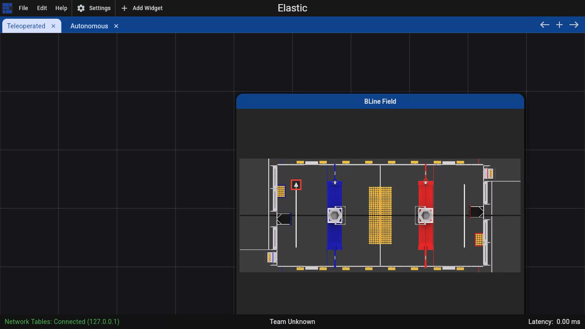

# Optional Field2d Visualization

`BLineField` can draw a loaded BLine polyline on WPILib `Field2d` for display in Elastic, Glass, or another compatible dashboard. This is an optional visualization and debugging aid: BLine does not require a `Field2d` to load or follow paths.

It is most useful for confirming that the robot loaded the intended file, the selected path is on the expected field side, and the live pose uses the same coordinate frame. It is not a replacement for logs, simulation, or a controlled robot test.

Do not add Field2d solely because BLine is in the robot project. If your team already verifies auto selection and pose through another tested dashboard or logging workflow, path following works without this page's setup.

## Publish the field

```java
import edu.wpi.first.wpilibj.smartdashboard.Field2d;
import edu.wpi.first.wpilibj.smartdashboard.SmartDashboard;
import frc.robot.lib.BLine.BLineField;
import frc.robot.lib.BLine.Path;

Field2d field = new Field2d();
SmartDashboard.putData("Field", field);

Path scoreTwo = new Path("score-two");
BLineField.drawPath(field, "ScoreTwo", scoreTwo);
```

The explicit name is normalized to `ScoreTwoTrajectory`. If it already ends in `Trajectory`, BLine leaves it unchanged.

The `Trajectory` suffix matters for Elastic: it lets even a short list of poses render as a connected line instead of separate pose arrows.

## Use stable display slots

Reusing an explicit name updates the same Field2d object:

```java
BLineField.drawPath(field, "SelectedAuto", selectedPath);
```

This is useful when an autonomous chooser changes. The dashboard keeps one predictable display slot.

The unnamed overload returns an automatically assigned stable name for the same `Field2d` and `Path` instance:

```java
String objectName = BLineField.drawPath(field, scoreTwo);
```

Prefer explicit names for operator-facing displays.

## What is drawn

`Path.getTranslations()` returns waypoint and translation-target positions in path order. It ignores rotation targets and event triggers. `BLineField` publishes those points as a connected polyline.

```java
List<Translation2d> anchors = scoreTwo.getTranslations();
```

This is the authored geometry—not an animated prediction, time-parameterized trajectory, or simulated robot path.

## What you should see in Elastic

A useful Elastic field view has two independent layers:

- the selected BLine path as a connected polyline; and
- the live robot pose from the same `Field2d`.

The line should pass through every authored waypoint and translation target. It does not show rotation targets, event locations, handoff circles, constraint ranges, or a moving preview robot. Keep BLine Web open when those authoring details matter.

A representative operator layout places the autonomous chooser beside this field view so the readable selection, connected path object, and live robot pose can be checked together. The line is planned geometry, not a time-parameterized trajectory.

{ .gif-demo data-gif-source="/assets/gifs/web/elastic-field2d.gif" data-gif-poster="/assets/images/gif-posters/elastic-field2d-start.png" data-gif-end="/assets/images/gif-posters/elastic-field2d-end.png" data-gif-duration="5000" }
{ .gif-print-poster }

This demonstration uses Elastic `2026.1.2` connected to a real local NetworkTables server. The white lines are published path objects; the red outlined marker is the separately published live robot pose. The field background is the current 2026 REBUILT field bundled with Elastic.

## Show the live robot too

Update the standard robot pose separately:

```java
field.setRobotPose(driveSubsystem.getPose());
```

With the planned polyline and live pose visible together, operators can investigate:

- the wrong path selected;
- a stale/missing deploy file;
- a coordinate-origin or alliance-transform mistake; and
- a robot pose that does not match its field placement.

## When to draw transformed paths

`BLineField.drawPath` displays the `Path` object you pass. If the command builder will flip/mirror only its internal copy at initialization, drawing the original object still shows the authored blue-origin path.

For an operator preview of the actual alliance-side route, make a copy and apply the same intended transform before drawing it. Keep that preview policy in one place so the display and command cannot be double-transformed independently.

## Optional match-day check

If your team puts this view on the drive dashboard, use it before enabling autonomous:

1. Confirm chooser name and displayed path agree.
2. Confirm the first point matches the robot's physical start.
3. Confirm the live pose is on the same field side.
4. Confirm the planned route clears field geometry.
5. Confirm alliance flip/mirror policy exactly once.

Field2d can expose selection and coordinate mistakes; it does not validate constraints, events, heading targets, controller tuning, or physical feasibility. A team that does not use Field2d can perform the same checks from its chooser, pose telemetry, logs, and tested autonomous procedure.
